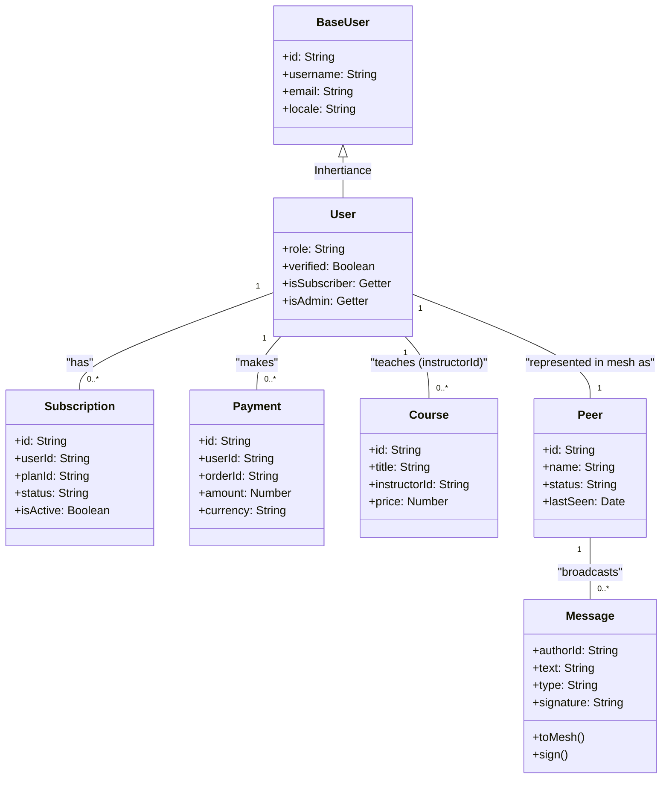

# Технічна Архітектура Домену Will-n-i 🏛️

Цей документ описує структуру даних та взаємодію компонентів суверенної цифрової держави. Кожна модель у домені слідує патерну **Model-as-Schema**, що дозволяє автоматично генерувати UI (форми, таблиці) та проводити валідацію.

## 📊 Діаграма зв'язків (Entity Relationship)

## 🏗️ Структурні Шари

### 1. Доменний шар (Domain Layer)

- **BaseUser / User**: Фундамент ідентичності. `BaseUser` містить технічні дані, `User` — соціальну роль та статус верифікації (2 Live Witnesses).
- **Subscription & Payment**: Економічний шар. Підписки визначають рівень доступу до знань, платежі фіксують транзакції в системі $WILLNI.
- **Course**: Навчальний контент, що створюється ко-креаторами.

### 2. Суверенний шар (Sovereign / Mesh)

- **Peer**: Відображення живої людини в децентралізованій мережі. Використовує IPNS або Ed25519 публічний ключ як ID.
- **Message**: Одиниця передачі волі (інтенції). Кожне повідомлення підписується прихованим приватним ключем (`IdentityManager`) і перевіряється іншими вузлами.
- **Bit-Sovereign Protocol**: Компактна серіалізація через `:` для передачі через слабкі канали зв'язку (~300 bps).

### 3. Інтерфейсний шар (CLI & UI)

- **SovereignCLI**: Головний диспетчер команд. Використовує патерн **Message-Handler** для обробки інтенсій.
- **IdentityManager**: Керує локальним сховищем ключів (`cli/data/identity.json`), забезпечуючи суверенітет ідентичності без центрального сервера.

## 🛠️ Принципи Розробки (NaN0Web Standards)

1. **Tabs over Spaces**: Відступи лише табуляцією.
2. **No Semicolons**: JavaScript код без крапок з комою.
3. **Model-as-Schema**: Опис полів через `static` властивості з `help` текстом та `default` значеннями.
4. **Ukrainian context**: Весь користувацький досвід та внутрішня комунікація базуються на українських смислах.
