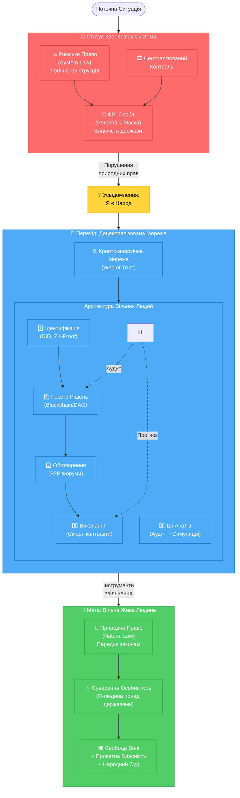

# Will-n-i: Цифрова Держава Суверенних Громадян

> "Я є Всесвіт. Всесвіт є Я."

Цей проект — інженерна відповідь на кризу довіри до централізованих інституцій. мИ будуємо цифрову інфраструктуру, яка слугує перехідним етапом від "людини-кріпака" до "суверенної особистості".

## 🗺 Логічна Схема Системи

<h2 id="content">📚 Фундаментальні Розділи</h2>

Детальний опис концепції та реалізації винесено в окремі документи:

- **[🔄 Перехід: Від Кріпака до Суверенна](./transition.md)**  
  Чому мИ зараз є "ресурсом" системи і як технічно повернути суб'єктність.

- **[⚖️ Правовий Фундамент](./law.md)**  
  Аналіз конфлікту Римського права (держава як власник особи) та Природного права (невід'ємні права).

- **[🌐 Реалізація Мережі](./network.md)**  
  Опис децентралізованої крипто-анархічної мережі, що діє як "екзоскелет" для захисту прав.

- **[🧠 Філософія: Суб’єктивний Всесвіт](./philosophy.md)**  
  Чому "Я є Всесвіт". Тотожність суб'єкта та реальності. Ментальні матриці та стоїцизм.

- **[🛣 Дорожня Карта та Принципи](./roadmap.md)**  
  Етапи впровадження (від паралельної системи до масштабування) та захист від концентрації влади (Fork-право).

- **[📜 Маніфест та Термінологія](./system.md)**  
  Воля понад усе. Словник термінів (Я, тИ, мИ) та принципи протоколу.

- **[⚖️ Відновлення Справедливості](./justice.md)**  
  Народний Суд, звернення до Конституційного Суду та міжнародне визнання суб'єктності українського народу.

---

## 🏗️ Архітектура вільних людей

мИ будуємо систему, що базується на криптографічних доказах замість довіри до чиновників.

### 1️⃣ Рівень ідентифікації (людина = 1 голос)
* **Ціль:** Уникнути підміни та ботоферм.
* **Інструменти:** DID, криптографічні ключі, ZK-Proof, Web of Trust (Живі Свідки).
* **Принцип:** Ключ знаходиться під виключним контролем власника. Втрата ключа вирішується через процедуру живого свідчення (Web of Trust).

### 2️⃣ Рівень реєстру рішень
* **Ціль:** Незмінність історії.
* **Інструменти:** Блокчейн / DAG.
* **Суть:** Для глобального консенсусу мИ використовуємо розподілений реєстр (DLT) для бюджетів, законів та контрактів.

### 3️⃣ Рівень обговорення
* **Ціль:** Прозоре обговорення (народні дебати).
* **Інструменти:** IPFS, P2P форуми (як Nostr або Radicle).
* **Суть:** Голосування фіксується в блокчейні, але дебати проходять у стійкому до цензури середовищі.

### 4️⃣ Рівень Ші-аналізу
* **Ціль:** Боротьба з корупцією та некомпетентністю на етапі проекту.
* **Функція:** Ші аналізує та підсвічує ризики, аномалії в бюджетах та конфлікти інтересів.

### 5️⃣ Рівень виконання
* **Ціль:** Автоматизація без чиновника.
* **Інструменти:** Смарт-контракти.
* **Суть:** Якщо рішення прийнято, кошти розподіляються кодом, а не підписом клерка.

---

## 🧠 Філософія проекту

> *"Якщо Я як людина існую — то існує Всесвіт. Якщо людина відсутня — немає суб’єкта сприйняття."*

мИ опираємось на сплав:
1. **Стоїцизму**: Внутрішній суверенітет та відповідальність.
2. **Растафаріанства**: Відкидання штучних вавилонських ієрархій.
3. **Критичного Соліпсизму**: Я відповідаю за свою реальність і зберігаю повну відповідальність за свої дії.

мИ залишаємо старі обмеження в минулому. мИ будуємо інструмент волі.
