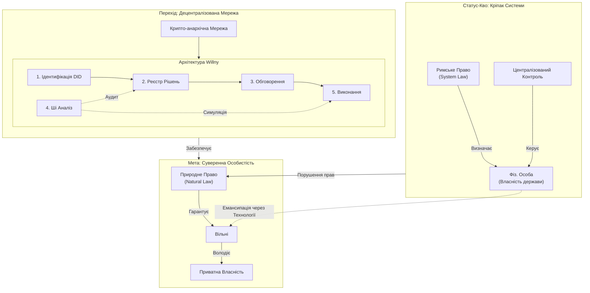

# Willny: Цифрова Держава Суверенних Громадян

> "Я є Всесвіт. Всесвіт є Я."

Цей проект — інженерна відповідь на кризу довіри до централізованих інституцій. мИ будуємо цифрову інфраструктуру, яка слугує перехідним етапом від "людини-кріпака" до "суверенної особистості".

## 🗺 Логічна Схема Системи

## 📚 Фундаментальні Розділи

Детальний опис концепції та реалізації винесено в окремі документи:

- **[🔄 Перехід: Від Кріпака до Суверенна](./transition.md)**  
  Чому ми зараз є "ресурсом" системи і як технічно повернути суб'єктність.

- **[⚖️ Правовий Фундамент](./law.md)**  
  Аналіз конфлікту Римського права (держава як власник особи) та Природного права (невід'ємні права).

- **[🌐 Реалізація Мережі](./network.md)**  
  Опис децентралізованої крипто-анархічної мережі, що діє як "екзоскелет" для захисту прав.

- **[🧠 Філософія: Суб’єктивний Всесвіт](./philosophy.md)**  
  Чому "Я є Всесвіт". Тотожність суб'єкта та реальності. Ментальні матриці та стоїцизм.

- **[🛣 Дорожня Карта та Принципи](./roadmap.md)**  
  Етапи впровадження (від паралельної системи до масштабування) та захист від концентрації влади (Fork-право).

---

## 🏗️ Архітектура Willny

мИ будуємо систему, яка не залежить від довіри до чиновників.

### 1️⃣ Рівень ідентифікації (людина = 1 голос)
* **Ціль:** Уникнути підміни та ботоферм.
* **Інструменти:** DID, криптографічні ключі, ZK-Proof (доведення без розкриття даних).
* **Принцип:** Держава не володіє вашим ключем. Втрата ключа = втрата доступу, але й неможливість конфіскації.

### 2️⃣ Рівень реєстру рішень
* **Ціль:** Незмінність історії.
* **Інструменти:** Блокчейн / DAG.
* **Суть:** Гіт недостатній для глобального консенсусу. Потрібен distributed ledger для бюджетів, законів та контрактів.

### 3️⃣ Рівень обговорення
* **Ціль:** Прозора делаберація.
* **Інструменти:** IPFS, P2P форуми (як Nostr або Radicle).
* **Суть:** Голосування фіксується в блокчейні, але дебати проходять у стійкому до цензури середовищі.

### 4️⃣ Рівень Ші-аналізу
* **Ціль:** Боротьба з корупцією та некомпетентністю на етапі проекту.
* **Функція:** Ші не вирішує, а підсвічує ризики, аномалії в бюджетах та конфлікти інтересів.

### 5️⃣ Рівень виконання
* **Ціль:** Автоматизація без чиновника.
* **Інструменти:** Смарт-контракти.
* **Суть:** Якщо рішення прийнято, кошти розподіляються кодом, а не підписом клерка.

---

## 🧠 Філософія проекту

> *"Якщо Я як людина існую — то існує Всесвіт. Якщо людина відсутня — немає суб’єкта сприйняття."*

мИ опираємось на сплав:
1. **Стоїцизму**: Внутрішній суверенітет та відповідальність.
2. **Растафаріанства**: Відкидання штучних вавилонських ієрархій.
3. **Критичного Соліпсизму**: Я відповідаю за свою реальність і не можу перекласти відповідальність на "систему".

мИ не будуємо "цифровий концтабір". мИ будуємо інструмент, щоб вийти з нього.
