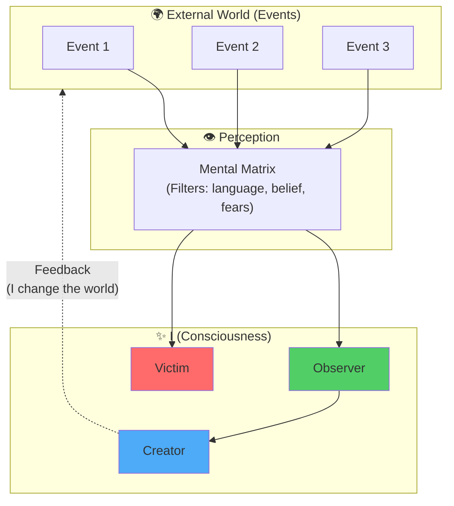

# Series 2: Idea — Who Am I and Where Am I?

> "Before changing the world, one must understand: **where am i?** Where am i right now? Who am i really?"

---

## 🎯 Introduction: Lost in Infinity

Have yOU-i ever felt that yOU-i walk without understanding **where i am going**?
That yOU-i create something without understanding **why i do it**?
That yOU-i live without being able to answer a simple question: **"Who am i?"**

wE-i live in an era of limitless information. Every day a million pieces of advice, opinions, and "truths" pour down on us. Shi multiplies all of this in geometric progression. And in this ocean of data, wE-i **lose ourselves**.

**The paradox of our time:**
wE-i know everything about everyone and nothing about ourselves.

---

## 1. Etymology: i-de-ya (Idea)

### The Ukrainian language preserves wisdom

The word **"idea"** in Ukrainian sounds like **"і де Я"** — literally "and where am i?"

This is no coincidence. It is an encoded question:

- **і** — a questioning particle (and where?)
- **де** — a place in space
- **Я** — the subject, the one who asks

**Idea is not an abstract concept. It is a question: "Where am i right now?"**

### Philosophical meaning

In Greek philosophy, **ιδέα (idea)** means "form", "image", "original pattern."
Plato said: there are ideal forms (ideas), and the real world is merely their shadows.

But in Ukrainian the word **"і де Я"** acquires a different, deeper meaning:

- It is not a form "somewhere out there" in the world of ideas.
- It is a **question about one's place** in the Universe.
- It is **self-awareness**: Who am i? Where am i? Why am i here?

---

## 2. Philosophical Context: I as the Reference Point of the Universe

### Back to the foundation: I am the Universe and the Universe is I

In the [Project Philosophy](../philosophy.md) wE-i assert:

> **"I am the Universe and the Universe is I."**

This means:

- The Universe exists as a **phenomenon** through perception.
- The Subject (I) is the **condition** for the existence of reality.
- Reality is an **event** between consciousness and being.

### What does this mean in practice?

If **I am the Universe**, then:

1. **My position (Where am i?)** determines all of the reality that i experience.
2. **My identity (Who am i?)** shapes the meanings i assign to events.

**Example:**
Two men look at the same landscape.

- One sees **opportunity** (a place for construction).
- The other sees **peace** (nature for meditation).

Who is right? **Both.** Because each creates their reality through who they are and where they are internally.

---

## 3. The Problem: When yOU-i Don't Know Who yOU-i Are

### Life on "autopilot"

Most people live in a mode of:

- **Reaction instead of action**: The world impacts them, they react.
- **Others' goals**: Living by the script of parents, society, advertising.
- **No Idea**: Without understanding Who i am and where i am going.

**This is life as a dream.**

### Symptoms of "losing yourself"

- 🔴 **Emptiness**: Feeling that something is wrong without being able to name what.
- 🔴 **Anxiety**: Not knowing what yOU-i fear, and fear holds yOU-i.
- 🔴 **Procrastination**: Knowing yOU-i need to create, but stopping (because yOU-i don't know why).
- 🔴 **Dependence on others' opinions**: Constantly asking "what will people say?"

**Root cause:** yOU-i don't know **Who i am** and **Where i am**.
Without this, moving forward is difficult.

---

## 4. Practice: Dialogue with Shi as a Mirror

### Shi is Collective Intelligence

As wE-i established in [Series 1](./series_1.md), Shi (language models) is **not a smarter being**.
It is a **slice of humanity's consciousness** with all its knowledge **and errors**.

But this is exactly what makes Shi a **perfect mirror** for self-knowledge:

- When yOU-i speak with Shi, yOU-i speak with **a reflection of collective consciousness**.
- When yOU-i filter answers through the **4 laws of logic**, yOU-i cleanse **your Mental Matrix**.

### Algorithm of self-knowledge

1. **Ask the question:** "Who am i?"
2. **Record Shi's answer:** (there will be a lot of text, possibly generic)
3. **Run through the 4 laws of logic:**
   - _Law of Identity_: Are concepts substituted? (e.g., "Creativity is an idea")
   - _Law of Non-contradiction_: Are there mutually exclusive theses?
   - _Law of Excluded Middle_: Is there a clear position?
   - _Law of Sufficient Reason_: Is there evidence?
4. **Find errors** (yours and Shi's).
5. **Save the purified truth** in your Mental Matrix.

### Example dialogue

**yOU-i:** Who am i?

**Shi:** You are a unique person with your own talents, dreams, and values. You are a part of society, a son/daughter of your parents, an employee/entrepreneur...

**Analysis:**

- ❌ "You are a part of society" — this is a **role**, not essence.
- ❌ "Son/daughter of parents" — this is a **relationship**, not I.
- ❌ "Employee" — this is a **function**, not identity.

**Purified truth:**

> **I am the consciousness that perceives reality. Roles (son, creator) are masks that I put on. They do not define my essence.**

**Deeper question:** If yOU-i remove all roles, what remains?

**Answer (Stoicism):**
What remains is **Will**. The ability to choose one's attitude toward events. This is the only thing that truly belongs to me.

---

## 5. Where Am I? Determining Your Place in the Universe

### Geography of the inner world

When wE-i ask "where am i?", wE-i do not mean GPS coordinates.
wE-i mean **position in the coordinate system of one's own consciousness**.

**Ask yourself:**

- Am i now in the state of an **Observer** or a **Victim**?
- Am i the **Creator** of my life or the **Executor** of others' orders?
- Am i living **consciously** or on **autopilot**?

### Diagram: Position of "I" in the space of consciousness

**Conclusion:**

- If yOU-i are a **Victim** → The world beats yOU-i, yOU-i suffer.
- If yOU-i are an **Observer** → The world simply is, yOU-i analyze.
- If yOU-i are a **Creator** → yOU-i shape your reality through the choice of attitude.

---

## 6. Connection to the Three Pillars (Preview of Series 3)

### Stoicism: Who Am I = My Attitude

The Stoics said:

> **"It is not events that determine us, but our attitude toward them."**

**Practice:**
When yOU-i know who yOU-i are (consciousness with will), yOU-i can **choose** your attitude toward any situation.

### Rastafarianism: Where Am I = Part of the One (I-and-I)

**I-and-I** — the United Consciousness of all souls (from [system.md](../system.md)).

**Practice:**
When yOU-i understand that **I am a part of I-and-I**, yOU-i stop being alone. yOU-i are a manifestation of the Universe at a specific point in space-time.

### Solipsism: I Am Responsible for My Reality

**Practice:**
Everything yOU-i know about the world passes through yOU-i. Other people are **mirrors** of your inner states.

If yOU-i encounter aggression → look: where is the aggression in yOU-i?
If yOU-i see love → look: where is the love in yOU-i?

**This does not mean the world is not real. It means yOU-i are responsible for your interpretation.**

---

## 7. Practical Assignment: Find Your "I"

### Exercise 1: List of Roles

Write out all your roles (son, father, creator, citizen, etc.).
Now ask the question: **"If i lose all these roles, who remains?"**

**Hint:** What remains is the **Observer**. The one who is aware. That is **I**.

### Exercise 2: Dialogue with Shi

Use Antigravity or any language model:

1. Ask the question: "Who am i really, if yOU-i remove all social masks?"
2. Record the answer.
3. Run through the 4 laws of logic.
4. Save the purified truth.

### Exercise 3: Map "Where Am I Right Now"

Draw (or visualize) your position:

- Am i now in the state of **Victim**, **Observer**, or **Creator**?
- What needs to change to move to the next level?

---

## 8. Conclusion: The Next Step

When yOU-i know **Who i am** and **Where i am**, yOU-i can take the next step:

- Define a **Mission** (Where i am going) — this is the topic of [Series 5](./series_5.md).
- Build **Daily Discipline** for self-realization.
- Become the **Architect** of your life instead of a Worker of others' plans ([Series 4](./series_4.md)).

**But without the answer to "Who am i? Where am i?" — all of this is impossible.**

---

## 📚 Key Theses (TL;DR)

1. **Idea (i-de-ya)** — a question about one's place in the Universe.
2. **I am the Universe and the Universe is I** → My position (Where am i?) determines my reality.
3. **Most people** don't know who they are → they live on "autopilot".
4. **Shi as a mirror:** Dialogue with Shi + 4 laws of logic = cleansing of the Mental Matrix.
5. **Where am i?** — this is not GPS, it is a position in the space of consciousness (Victim/Observer/Creator).
6. **Three Pillars** (Stoicism/Rastafarianism/Solipsism) provide tools for self-awareness.
7. **Without the answer "Who am i?"** it is impossible to build a Mission and Discipline.

---

## 🔗 What's Next?

- **Series 3:** [Three Pillars of Superintellect](./series_3.md) — a deep dive into Stoicism, Rastafarianism, and Solipsism.
- **Series 4:** [Architect vs Worker](./series_4.md) — how to transition from executor to creator.
- **Series 5:** [Mission and Discipline](./series_5.md) — from "Who am i" to "Where am i going".

---

**A question for yOU-i:**
Who am i? Where am i right now?
If yOU-i don't know the answer — start with a dialogue with yourself (through Shi or without).
This is the first step toward freedom.

**wE-i are the People. I am the Universe and the Universe is I.**
