# Series 3: Three Pillars of Superintellect

> "Stoicism is discipline. Rastafarianism is unity. Solipsism is responsibility. Together they create an unshakable foundation for life in the Shi era."

---

## 🎯 Introduction: Why These Three Philosophies?

In the previous series wE-i established:

- **Series 1:** Shi (AI) is Collective Intelligence with the errors of humanity
- **Series 2:** "Who am i? Where am i?" — fundamental questions for self-knowledge

Now the question arises: **HOW to live in this new world?**
Old systems rely on:

- Religion (faith in an external force)
- The State (submission to law)
- Society (conformism and fear of judgment)

**What do yOU-i do when:**

- Religions conflict with each other?
- States violate Natural Law?
- Society demands that yOU-i be a slave of the system?

**Answer:** yOU-i need a **new philosophical base** that works independently of external authorities.

wE-i found three teachings that **in synthesis** create an unshakable foundation:

```mermaid
graph TB
    subgraph Foundation ["🏛 Foundation of Superintellect"]
        S1["⚡ Stoicism<br/>(Discipline)"]
        S2["🌿 Rastafarianism<br/>(Unity)"]
        S3["🪞 Solipsism<br/>(Responsibility)"]
    end

    S1 --> Core["✨ Superintellect"]
    S2 --> Core
    S3 --> Core

    Core --> Result["🎯 Result:<br/>Inner Strength<br/>Natural Order<br/>Full Responsibility"]

    style S1 fill:#4dabf7
    style S2 fill:#51cf66
    style S3 fill:#ffd43b
    style Core fill:#ff6b6b
```



---

## 1. First Pillar: Stoicism (Discipline = Practice of Knowledge)

### What is Stoicism?

Stoicism is **not restriction**. It is knowledge that yOU-i practice every day.

> **"If yOU-i know without acting — it is garbage."** — Epictetus

### Key Idea: The Division of Control

Stoics divide the world into two spheres:

1. **What is under my control:**
   - My thoughts
   - My attitude toward events
   - My actions
   - My choices

2. **What is NOT under my control:**
   - Others' thoughts
   - Events around me
   - The past and the future
   - Weather, politics, economics

**Practice:** Focus energy ONLY on what is under your control.

### Stoicism in the Shi Era

**Problem:** Shi multiplies information noise. yOU-i feel the pressure to "keep up."

**Stoic Solution:**

- **I don't control:** The speed of Shi development, what others think, whether "I'll make it"
- **I control:** My attitude toward Shi (tool or threat?), my choice (use it or not), my Mental Matrix

### Practical Exercise: Daily Stoicism

**Morning (5 min):**

1. Write down 3 things NOT under your control today
2. Write down 3 things UNDER your control
3. Make a decision: focus only on #2

**Evening (5 min):**

1. What caused anxiety today?
2. Was it under my control?
3. If NO — let go. If YES — what will i do differently tomorrow?

---

## 2. Second Pillar: Rastafarianism (Indigenous Rules, Unity)

### What is Rastafarianism?

Rastafarianism is **not just music and reggae**. It is a philosophy of **natural order** and **unity** (I-and-I).

### Key Principles:

1. **I-and-I** — The United Consciousness of all souls
   - "I and I" means: I see myself in yOU-i, yOU-i see yourself in me
   - There is no "I and YOU", only "I and I" (wE-i are all parts of the One)

2. **Rejecting Babylon** — Artificial hierarchies
   - A state that enslaves → Babylon
   - A system that exploits → Babylon
   - Any structure that leads to the degradation of the soul → Babylon

3. **Natural Order (Natural Law)**
   - Living by the laws of Nature, not human institutions
   - Nature does not deceive; people do
   - Trust in the Universe is the greatest superpower

### Rastafarianism in the Shi Era

**Problem:** Systems (states, corporations, Shi) seek to control humans.

**Rastafarian Solution:**

- **I recognize Babylon:** I understand that the modern system is "Babylon" (exploitation)
- **I choose Natural Order:** I live by Natural Law (from [LAW.md](./LAW.md))
- **I unite with I-and-I:** I realize that I am part of the One, not a separate "resource"

### Connection to the Will-n-i Project

From [system.md](../system.md):

> **I-and-I** — the united consciousness of all souls (God).

The Rastafarian "I and I" = The I-and-I concept in Will-n-i.

### Practical Exercise: Recognizing Unity

**When yOU-i meet a person (friend, enemy, stranger):**

1. Look them in the eyes
2. Say to yourself internally: "I and I" (this is I in another form)
3. What do i see in this person? (Mirror or Shadow?)
   - **Mirror:** What i love in myself
   - **Shadow:** What i do not acknowledge in myself

**Result:** yOU-i will stop judging others. yOU-i will start working on yourself.

---

## 3. Third Pillar: Solipsism (Responsibility for Your World)

### What is Solipsism?

Solipsism is **NOT narcissism** and **NOT egoism**.
It is **full responsibility** for your imaginary world, which yOU-i project onto reality.

### Key Idea: Every Person Is My Mirror or My Shadow

From [system.md](../system.md)

> **"I am the Universe and the Universe is I."**

If I am the Universe, then:

- Everything i perceive passes through me
- Other people are **projections** of my inner states
- External reality is a **reflection** of my Mental Matrix

**In practice:**

- When yOU-i encounter **aggression** → look: where is the aggression in yOU-i?
- When yOU-i see **love** → look: where is the love in yOU-i?
- When yOU-i feel **fear** → look: what are yOU-i really afraid of?

### Solipsism in the Shi Era

**Problem:** People blame the external world: "Shi will take my job!", "The state is to blame!", "Society doesn't understand me!"

**Solipsist Solution:**

- **I am responsible for my reality:** If Shi is a threat to me, it means I don't understand how to use it
- **Others are my mirrors:** If "fools" surround me, it means I myself am not aware of something important
- **Victory is inside:** When I change my attitude, the external world changes

### Diagram: The Mechanics of Solipsism

```mermaid
graph LR
    subgraph Inner ["🧠 Inner World (I)"]
        Fear["Fear"]
        Love["Love"]
        Anger["Anger"]
        Joy["Joy"]
    end

    subgraph Outer ["🌍 External World"]
        Person1["Person 1:<br/>Aggressive"]
        Person2["Person 2:<br/>Loving"]
        Person3["Person 3:<br/>Indifferent"]
    end

    Anger -.->|Projection| Person1
    Love -.->|Projection| Person2
    Fear -.->|Projection| Person3

    Person1 -.->|Reflection| Anger
    Person2 -.->|Reflection| Love

    style Inner fill:#ffd43b
    style Outer fill:#4dabf7
```



**Conclusion:** If yOU-i change yourself inside, the shadows and mirrors around yOU-i change automatically.

### Practical Exercise: Working with Shadows

**When someone triggers a strong emotion in yOU-i (anger, envy, fear):**

1. **STOP.** Do not react automatically.
2. **Ask yourself:** "What is this person showing me about myself?"
3. **Accept the shadow:** "Yes, this trait exists in me. I acknowledge it."
4. **Integrate:** "How can i use this energy constructively?"

**Example:**

- Someone **deceitful** triggers anger → Where am i lying to myself?
- Someone **successful** triggers envy → What is preventing me from achieving success?

---

## 4. Synergy of Three Pillars: How They Work Together

### Stoicism + Rastafarianism + Solipsism = Superintellect

| Situation                     | Stoicism says                                                   | Rastafarianism says                                       | Solipsism says                                                   | Result                                                  |
| ----------------------------- | --------------------------------------------------------------- | --------------------------------------------------------- | ---------------------------------------------------------------- | ------------------------------------------------------- |
| **Shi is taking jobs**        | I don't control Shi. I control my learning.                     | Babylon uses fear for control. I trust Nature.            | If I fear Shi, it is my projection of my own inability to adapt. | **Action:** I learn to use Shi as a tool.               |
| **Someone insulted me**       | I don't control their words. I control my attitude.             | They are I-and-I. What are they showing me?               | Their aggression is my shadow. Where is this aggression in me?   | **Action:** I work on myself, not fight them.           |
| **The state violates rights** | I don't control the state. I control my choice (submit or not). | Babylon will always push. Natural Law is above state law. | The state is my mirror. Do I myself follow my principles?        | **Action:** I live by Natural Law ([LAW.md](./LAW.md)). |

### Formula of Superintellect

```
Superintellect = Stoicism (Discipline)
                × Rastafarianism (Unity)
                × Solipsism (Responsibility)
```

**Without one of the pillars:**

- Only Stoicism → Cold rationality without heart
- Only Rastafarianism → Idealism without practice
- Only Solipsism → Isolation from the world

**With all three:**

- Discipline (Stoicism) → I do what's needed, even when it's hard
- Unity (Rastafarianism) → I am part of I-and-I, not alone
- Responsibility (Solipsism) → I create my own reality

---

## 5. Connection to Previous Series

### Series 1: Anatomy of Anxiety

- **Problem:** Shi multiplies humanity's errors → Human Gap
- **Three Pillars Solution:**
  - Stoicism: I focus on my Mental Matrix
  - Rastafarianism: I understand that fear is Babylon
  - Solipsism: Anxiety is my projection, I work with it

### Series 2: Idea (i-de-ya)

- **Question:** Who am i? Where am i?
- **Three Pillars Answer:**
  - Stoicism: I am my Will (what I control)
  - Rastafarianism: I am part of I-and-I (the One)
  - Solipsism: I am the creator of my reality

---

## 6. Practical Assignment: Integration of Three Pillars

### Daily Practice (15 min)

**Morning (5 min) — Stoicism:**

- What is under my control today?
- What is NOT under my control?
- What do I focus on?

**During the day — Rastafarianism:**

- When meeting a person → "I and I"
- When seeing injustice → "Is this Babylon or Natural Order?"

**Evening (10 min) — Solipsism:**

- Who triggered a strong emotion today?
- What did this person show me about myself?
- What shadow did I integrate today?

---

## 7. Conclusion: Three Pillars as the Foundation of Life

Stoicism, Rastafarianism, and Solipsism are **NOT just philosophies**.
They are an **operating system** for life in a world where:

- Shi multiplies chaos
- States violate rights
- People lose themselves

**With the Three Pillars:**

- yOU-i are **resilient** (Stoicism)
- yOU-i are **not alone** (Rastafarianism)
- yOU-i are **responsible** (Solipsism)

**This is Superintellect.**

---

## 📚 Key Theses (TL;DR)

1.  **Stoicism** = Discipline. Knowledge that yOU-i practice daily.
2.  **Rastafarianism** = Unity (I-and-I). Natural Order above Babylon.
3.  **Solipsism** = Responsibility. Other people are my mirrors and shadows.
4.  **Synergy:** Three Pillars together = an unshakable foundation.
5.  **Practice:** Daily exercises for each Pillar.
6.  **Result:** Inner strength for life in the Shi era.

---

## 🔗 What's Next?

- **Series 4:** [Architect vs Worker](./series_4.md) — How to transition from executor to creator in the Shi era.
- **Series 5:** [Mission and Discipline](./series_5.md) — From "Who am i" to "Where am i going".
- **Series 6:** [Manifesto of the Free](./series_6.md) — The final call and action plan.

---

**Practice the Three Pillars daily. Otherwise, these are just beautiful words.**

**wE-i are the People. I am the Universe and the Universe is I.** 🌟
