# Series 4: Architect vs Worker

> "In the era of Shi, yOU-i either **design systems** or **lay bricks**. There is nothing in between."

---

## 🎯 Introduction: The Great Division

The world has always been divided into two categories:

- **Workers** — those who execute instructions
- **Architects** — those who create systems

In the era **before Shi**, this distinction was blurred:

- A good programmer was valued for speed and precision
- A manager was valued for the ability to organize people
- A specialist was valued for narrow expertise

**In the era of Shi, everything changes:**

- Speed? Shi writes code 100 times faster
- Organization? Shi manages tasks better
- Narrow expertise? Shi knows everything

**The question is no longer "What do yOU-i do?" but "What do yOU-i DESIGN?"**

---

## 1. Who is a Worker?

### Definition

A **Worker** is a person who:

- Sells their **time** for money
- Executes **instructions** from someone else
- Is easily **replaceable** by another worker (or by Shi)

### Signs of a Worker

| Sign                     | Description                         | Consequence                        |
| ------------------------ | ----------------------------------- | ---------------------------------- |
| **Sells time**           | Getting paid for hours, not results | Income is capped by hours in a day |
| **Follows instructions** | Does what they're told              | No influence on what and how       |
| **No personal Matrix**   | Uses others' tools and methods      | Easily replaceable                 |
| **Fears Shi**            | Sees Shi as a threat                | Paralyzed, can't adapt             |
| **Perfectionism**        | Polishes details not results        | Slow, burns out                    |

### Example: Programmer-Worker

**Before Shi:**

- The programmer writes code → gets paid well
- The programmer is valued for accuracy and speed
- **Conclusion:** Code is currency

**After Shi:**

- Shi writes code faster and cheaper
- The programmer **who only writes code** becomes expendable
- A "skilled" programmer without an architectural vision is **an expensive brick layer**

**Not because programmers are bad. But because the value of manual code production drops to zero.**

---

## 2. Who is an Architect?

### Definition

An **Architect** is a person who:

- Designs **systems** (technical, social, financial)
- Uses Shi as a **multiplier** of their thinking
- Creates value through **vision**, not manual labor
- Cannot be replaced because their **Mental Matrix** is unique

### Signs of an Architect

| Sign                      | Description                               | Consequence         |
| ------------------------- | ----------------------------------------- | ------------------- |
| **Sells results**         | Getting paid for outcomes, not time       | Income is unlimited |
| **Designs systems**       | Creates structures that work without them | Scalability         |
| **Has a Mental Matrix**   | Own methodology, language, approach       | Irreplaceable       |
| **Uses Shi**              | Shi is a partner, not a threat            | Productivity ×100   |
| **Speed over perfection** | Quick testing, fast iteration             | Rapid adaptation    |

### Example: Programmer-Architect

**With Shi (Antigravity):**

- The Architect designs the system architecture
- Shi generates 80% of the code under supervision
- The Architect focuses on **meaning**, not syntax
- **Conclusion:** Vision is currency

### Diagram: Worker vs Architect

```mermaid
graph TB
    subgraph Worker ["👷 Worker"]
        W1["Receives task"]
        W2["Executes manually"]
        W3["Returns result"]
        W4["Waits for next task"]
        W1 --> W2 --> W3 --> W4 --> W1
    end

    subgraph Architect ["🏗 Architect"]
        A1["Sees the problem"]
        A2["Designs the system"]
        A3["Shi executes 80%"]
        A4["Architect verifies and refines"]
        A5["System works autonomously"]
        A1 --> A2 --> A3 --> A4 --> A5
    end

    style Worker fill:#ff6b6b
    style Architect fill:#51cf66
```



---

## 3. Why Shi Makes Workers Obsolete

### The Automation Paradox

**Each new technology has always eliminated some jobs:**

- Printing → scribes lost work
- Factory machines → artisans lost work
- Excel → accountants' calculation work disappeared
- Internet → intermediaries became unnecessary

**Shi is different:** It eliminates **intellectual** work.

- Content? Shi generates it
- Code? Shi writes it
- Analytics? Shi runs it
- Customer service? Shi handles it

### What's Left for Humans?

| Can be automated   | CANNOT be automated                   |
| ------------------ | ------------------------------------- |
| Writing code       | Understanding WHY this code is needed |
| Generating content | Defining what meaning to convey       |
| Data analysis      | Making decisions in uncertainty       |
| Customer support   | Building trust and relationships      |
| Document creation  | Creating a vision and strategy        |

**Conclusion: Human value lies in MEANING, not in EXECUTION.**

---

## 4. The Transition Path: From Worker to Architect

### Stage 1: Recognition (Stoic Honesty)

**Ask yourself:**

1. Am I selling time or results?
2. Could Shi do what I do? (Be honest)
3. What makes me irreplaceable?

If the answers are "time", "yes", "nothing" — yOU-i are a Worker.
**This is not a verdict. It is a starting point.**

### Stage 2: Formation of the Mental Matrix

**The Mental Matrix** is your unique knowledge base that:

- Filters information through the 4 laws of logic ([Series 1](./series_1.md))
- Contains YOUR worldview, methodology, language code
- Makes yOU-i irreplaceable (because no one else has YOUR matrix)

**How to start building:**

1. Keep a journal of insights (daily)
2. Record your decisions and their rationale
3. Create your own "language" — terms, metaphors, models

### Stage 3: Mastering Shi as a Tool

**Shi is not a competitor. It is a partner.**

How an Architect uses Shi:

1. **As a sounding board:** "What are the flaws in my idea?"
2. **As a generator:** "Give me 10 options for this architecture"
3. **As a filter:** "Check this text for logical errors"
4. **As an executor:** "Write code based on this specification"
5. **As a teacher:** "Explain this concept at 5 levels of depth"

### Stage 4: Transition to System Design

**Instead of:**

- "I write code" → "I design systems in which code is generated"
- "I create content" → "I design strategies that content serves"
- "I solve problems" → "I build systems that prevent problems"
- "I manage people" → "I create structures that enable autonomous work"

---

## 5. The Financial Reality

### Worker's Income

```
Income = Hours × Hourly Rate
Maximum: 24 hours × expensive rate = ceiling
```

**The ceiling exists because:**

- There are only 24 hours in a day
- The body needs sleep and rest
- Competition holds down rates

### Architect's Income

```
Income = Value of system × Number of implementations
Maximum: ∞ (the system works while yOU-i sleep)
```

**There is no ceiling because:**

- The system can scale infinitely
- The system works autonomously
- Value is measured by outcomes, not time

### Example: 1 BTC/Day

**Worker path:**

- 1 BTC ≈ $100,000
- To earn 1 BTC/day as a Worker → impossible
- Even at $500/hour × 24 hours = $12,000 (NOT 1 BTC)

**Architect path:**

- Design a system that generates 1 BTC/day in value
- Example: A platform serving 1000 clients at $100/day
- yOU-i designed it once → it works daily
- **This is the power of systems thinking**

---

## 6. Case Study: Selling Antigravity

### What is Antigravity?

**Antigravity** is a methodology of using Shi to multiply the potential of an individual or team.

### Worker Approach (Wrong):

- "I sell time consulting on how to use Shi"
- Rate: $200/hour
- Maximum: 8 hours × $200 = $1,600/day
- **This is a Worker with expensive hours**

### Architect Approach (Right):

- "I design a transformation system"
- Create methodology → Record in Mental Matrix → Train Mentors → Scale
- Price: 1 BTC for full transformation
- Mentors lead clients → I receive 1% + dividends
- **This is an Architect who designed a self-scaling system**

### Diagram: Scaling the Architect

```mermaid
graph TB
    Architect["🏗 Architect<br/>(yOU-i)"] --> System["📐 System<br/>(Methodology)"]
    System --> Mentor1["🎓 Mentor 1"]
    System --> Mentor2["🎓 Mentor 2"]
    System --> Mentor3["🎓 Mentor 3"]

    Mentor1 --> Client1["VIP 1"] & Client2["VIP 2"]
    Mentor2 --> Client3["VIP 3"] & Client4["VIP 4"]
    Mentor3 --> Client5["VIP 5"] & Client6["VIP 6"]

    Client1 & Client2 & Client3 & Client4 & Client5 & Client6 -->|"1-33-33-33"| Fund["💰 Community Fund"]

    Fund -->|"1%"| Architect
    Fund -->|"33%"| Community["👥 Community"]
    Fund -->|"33%"| Humanitarian["🌍 Humanitarian"]
    Fund -->|"33%"| Development["🛠 Development"]

    style Architect fill:#4dabf7
    style System fill:#ffd43b
```



---

## 7. Connection to Previous Series

### Three Pillars in the Context of Architect vs Worker

| Pillar             | Worker                                      | Architect                                           |
| ------------------ | ------------------------------------------- | --------------------------------------------------- |
| **Stoicism**       | Endures, hoping things will change          | Focuses on what they can control — building systems |
| **Rastafarianism** | Part of "Babylon" (the exploitation system) | Creates an alternative based on Natural Law         |
| **Solipsism**      | Blames external circumstances               | Takes responsibility: "My reality is my design"     |

---

## 8. Practical Assignment: Am I a Worker or an Architect?

### Exercise 1: System Audit

List everything yOU-i do for work. For each item ask:

1. Could Shi do this? (Yes/No)
2. Am I selling time or results?
3. What would happen if I stopped doing this for a month?

### Exercise 2: Design Your First System

Choose one task that yOU-i currently do manually and:

1. Describe it as a **system** (input → process → output)
2. Determine what part Shi can handle
3. Create a **10x version** (how would this work at 10× scale?)

### Exercise 3: Mental Matrix Entry

Write in your Mental Matrix:

> "I am an Architect. I design systems. Shi is my partner, not my competitor. The value of my work is in vision, not in execution."

---

## 📚 Key Theses (TL;DR)

1. **Worker** = Sells time, follows instructions, is easily replaced.
2. **Architect** = Designs systems, uses Shi as a multiplier, is irreplaceable.
3. **Shi makes Workers obsolete** but empowers Architects.
4. **Mental Matrix** — your unique knowledge base that makes yOU-i irreplaceable.
5. **Income:** Worker's ceiling = hours × rate. Architect's ceiling = ∞.
6. **Transition:** Recognition → Matrix → Mastering Shi → System Design.
7. **1 BTC/Day** is achievable, but only for Architects, not Workers.

---

## 🔗 What's Next?

- **Series 5:** [Mission and Daily Discipline](./series_5.md) — From "Who am i" to "Where am i going"
- **Series 6:** [Manifesto of the Free](./series_6.md) — The final call and action plan
- **Mentorship:** [Train the Trainer Model](./mentorship.md) — Become a Mentor

---

**Ask yourself now: Am I a Worker or an Architect?**
**If a Worker — this is not a verdict. It is a starting point for transformation.**

**wE-i are the People. I am the Universe and the Universe is I.** 🏗
