# Series 5: Mission and Daily Discipline

> "When yOU-i know **Who i am** and **Where i am**, the question arises: **Where am i going?** This is a Mission. And the path to it is paved by daily Discipline."

---

## 🎯 Introduction: From Self-Knowledge to Action

In the previous series wE-i established:

- **Series 1:** Shi is Collective Intelligence with humanity's errors → wE-i need a Truth Filter
- **Series 2:** "Who am i? Where am i?" — the fundamental question of self-knowledge
- **Series 3:** Three Pillars (Stoicism + Rastafarianism + Solipsism) = unshakable foundation
- **Series 4:** Architect vs Worker — yOU-i either design systems or lay bricks

Now the question: **What for? Where am i going? What is my PURPOSE?**

Without a Mission:

- Stoicism becomes cold rigidity
- Architecture becomes meaningless construction
- Discipline becomes slavery

**Mission gives MEANING to everything.**

---

## 1. What is a Mission? (Mission ≠ Goal)

### Key Difference

|                   | Goal                           | Mission                                            |
| ----------------- | ------------------------------ | -------------------------------------------------- |
| **Duration**      | Finite (weeks, months, years)  | Lifelong                                           |
| **Measure**       | Measurable (earned X, built Y) | Directional (heading THERE)                        |
| **Motivation**    | External (money, status)       | Internal (meaning, calling)                        |
| **When achieved** | Checked off, emptiness follows | Never "achieved" — it is a path                    |
| **Example**       | "Earn 1 BTC"                   | "Create a world where technology serves the human" |

### Mission is a Direction, Not a Destination

**A metaphor:**

- A **Goal** is a point on the map: "I want to reach city X"
- A **Mission** is a compass direction: "I go North"

When yOU-i reach city X, yOU-i stop. When yOU-i go North — yOU-i always move.

### Why Most People Don't Have a Mission

1. **Nobody asked:** School, university, work — everyone asks "What will yOU-i do?" but nobody asks "Why?"
2. **Fear of grandeur:** "Who am i to have a Mission?" (See Solipsism: yOU-i are the Universe)
3. **Confusion with goals:** "My mission is to buy a house" — that's a goal, not a mission
4. **Others' scripts:** Living by parents'/society's plan → no room for your own Mission

---

## 2. How to Find Your Mission

### Method 1: Subtraction

**Remove everything external:**

1. Remove your profession → What remains?
2. Remove your status → What remains?
3. Remove money → What remains?
4. Remove others' opinions → What remains?

**What remains is the core of your Mission.**

### Method 2: The Child Question

**Ask yourself:** What did i love doing as a child, when nobody paid me for it?

- Drawing? → Mission may be connected to creation
- Taking things apart? → Mission may be connected to understanding systems
- Helping others? → Mission may be connected to service
- Telling stories? → Mission may be connected to communication of meaning

### Method 3: The Death Test

**Imagine:** yOU-i are 144 years old (see [THINKERS_REVIEW.md](./THINKERS_REVIEW.md)). yOU-i look back at life.

- What would yOU-i regret NOT doing?
- What would make yOU-i proud?
- What would yOU-i want to be remembered for?

**The answer to these questions is your Mission.**

### Method 4: Where Does It Hurt?

**What injustice in the world causes yOU-i the most pain?**

- Children's suffering → Mission: protect children
- Environmental destruction → Mission: preserve Nature
- Mental slavery → Mission: liberate minds (hello, Will-n-i!)

**Pain points to the Mission:** Where it hurts — there is your calling.

### Method 5: Dialogue with Shi

**Use Shi as a mirror:**

1. Tell Shi everything yOU-i love, hate, dream of, fear
2. Ask: "Based on all this, what could my Mission be?"
3. Run the answer through the 4 laws of logic
4. Save the purified result in the Mental Matrix

---

## 3. Kindred Work (Srodna Praca)

### Hryhorii Skovoroda on Mission

The Ukrainian philosopher Hryhorii Skovoroda (from [THINKERS_REVIEW.md](./THINKERS_REVIEW.md)) said:

> **"The world tried to catch me, but it did not succeed."**

His key idea — **Kindred Work (Srodna Praca)**:

- Every person is born with a natural inclination
- When yOU-i do what yOU-i were born for — it is Kindred Work
- Kindred Work is effortless and joyful (not because it's easy, but because it resonates)

### How to Recognize Kindred Work

| Sign            | Description                               |
| --------------- | ----------------------------------------- |
| **Flow**        | Time disappears when yOU-i do it          |
| **Energy**      | It gives energy rather than taking it     |
| **Naturalness** | It feels like "this is what i should do"  |
| **Growth**      | yOU-i constantly want to get better at it |
| **Meaning**     | yOU-i understand WHY yOU-i do it          |

### Kindred Work ≠ Hobby

A hobby is what yOU-i do for fun.
Kindred Work is what yOU-i do because **yOU-i can't NOT do it**.

- A hobby yOU-i can quit painlessly
- From Kindred Work yOU-i cannot leave — it IS yOU-i

---

## 4. Daily Discipline: The Operating System of Mission

### Why Discipline and Not Motivation?

**Motivation** is a feeling. It comes and goes.
**Discipline** is a system. It works regardless of feelings.

> **"wE-i don't wait for inspiration. wE-i create conditions for it."** — The Stoic approach

### Structure of the Day: Architect's Schedule

```mermaid
graph TB
    subgraph Morning ["🌅 Morning (1 hour)"]
        M1["Meditation / Silence (15 min)"]
        M2["Journal: Who am i today? (10 min)"]
        M3["Mission Alignment (5 min)"]
        M4["Planning: 3 Key Tasks (10 min)"]
        M5["Physical Practice (20 min)"]
    end

    subgraph Day ["☀️ Day (8-10 hours)"]
        D1["Deep Work: Mission-aligned tasks"]
        D2["Shi-Partnering: Use Shi for execution"]
        D3["Breaks: Walking, breathing"]
        D4["Community: Help others (I-and-I)"]
    end

    subgraph Evening ["🌙 Evening (30 min)"]
        E1["Review: What did i do today? (10 min)"]
        E2["Shadows: What triggered me? (10 min)"]
        E3["Gratitude: 3 things (5 min)"]
        E4["Tomorrow: Rough plan (5 min)"]
    end

    Morning --> Day --> Evening

    style Morning fill:#ffd43b
    style Day fill:#4dabf7
    style Evening fill:#845ef7
```

---

### Morning Ritual: Aligning with Mission

**15 min Meditation/Silence:**

- Sit in silence
- No phone, no Shi, no information
- Simply BE
- This is practice of the Observer (from [Series 2](./series_2.md))

**10 min Journal:**

- Write freely: What am i feeling? What am i thinking? Who am i today?
- No censorship, no structure
- This is Solipsism in practice: looking inward

**5 min Mission Alignment:**

- Read your Mission statement (from the exercises above)
- Ask: "Does what i planned for today serve my Mission?"
- If not — revise the plan

**10 min Planning:**

- Choose 3 (maximum!) key tasks
- Each task should move toward the Mission
- Remember: Architect designs, Worker fills time with tasks

**20 min Physical Practice:**

- Movement: yoga, running, pushups — anything
- The body is the vessel of consciousness; keep it in order
- Stoic principle: Discipline of the body = Discipline of the mind

---

### Daily Principles

**Principle 1: Deep Work**

- 2-4 hours of uninterrupted work on the most important thing
- No messengers, no social media
- This is where the real value is created

**Principle 2: Shi-Partnering**

- Use Shi for routine, execution, and research
- yOU-i provide the vision, Shi provides the speed
- Remember: yOU-i are the Architect, Shi is the builder

**Principle 3: I-and-I in Practice**

- At least once a day, help someone without expecting anything in return
- This is Rastafarianism in action: wE-i are all one
- The community grows through generosity

---

### Evening Ritual: Review and Integration

**10 min Review:**

- What did i accomplish today?
- What moved me toward the Mission?
- What was a waste of time? (Be honest — Stoicism)

**10 min Shadow Work:**

- Who or what triggered a strong emotion today?
- What did this show me about myself? (Solipsism)
- Did i integrate this shadow or run from it?

**5 min Gratitude:**

- Name 3 specific things yOU-i are grateful for
- This rewires the brain toward abundance, not scarcity
- Even on the worst day, there are 3 things

**5 min Tomorrow:**

- Rough outline of tomorrow's 3 key tasks
- This gives the subconscious mind direction during sleep

---

## 5. The Mission-Discipline Cycle

### How They Reinforce Each Other

```mermaid
graph LR
    Mission["🎯 Mission<br/>(Direction)"] --> Discipline["⚡ Discipline<br/>(Daily Practice)"]
    Discipline --> Results["📈 Results<br/>(Progress)"]
    Results --> Clarity["🔍 Clarity<br/>(Refined Mission)"]
    Clarity --> Mission

    style Mission fill:#ff6b6b
    style Discipline fill:#4dabf7
    style Results fill:#51cf66
    style Clarity fill:#ffd43b
```

**Explanation:**

1. **Mission** gives direction → yOU-i know WHERE to go
2. **Discipline** creates a daily path → yOU-i move CONSISTENTLY
3. **Results** prove that the path works → yOU-i gain CONFIDENCE
4. **Clarity** refines the Mission → yOU-i see MORE CLEARLY
5. Back to 1, but at a higher level

**This is a spiral, not a circle.** Each cycle brings yOU-i higher.

---

## 6. Common Traps

### Trap 1: "I don't have time for discipline"

**Truth:** yOU-i don't "have" time, yOU-i choose how to use it.
Everyone has 24 hours. The difference is in the CHOICE.

**Solution:** Start with 15 minutes. Not an hour. 15 minutes of conscious practice.

### Trap 2: "I missed a day, everything is ruined"

**Truth:** Missing a day is not failure. Quitting is failure.
The Stoics say: fall down seven times, stand up eight.

**Solution:** If yOU-i miss — simply resume tomorrow. No guilt, no drama.

### Trap 3: "My Mission should be grand"

**Truth:** A Mission doesn't have to save the world.
"Being the best father i can be" is a valid Mission.

**Solution:** Start with what resonates in your heart, not what looks impressive.

### Trap 4: "Discipline = suffering"

**Truth:** Discipline is NOT punishment. It is care for yourself.
Brushing your teeth is discipline. It is not suffering.

**Solution:** Frame discipline as LOVE for your future self.

---

## 7. Connection to Previous Series

| Series                       | Without Mission & Discipline                             | With Mission & Discipline                          |
| ---------------------------- | -------------------------------------------------------- | -------------------------------------------------- |
| **Series 1** (Truth Filter)  | Filtering without purpose → academic exercise            | Filtering FOR the Mission → practical power        |
| **Series 2** (Who am i?)     | Knowing who i am without direction → existential crisis  | Knowing who i am AND where i'm going → clarity     |
| **Series 3** (Three Pillars) | Stoicism, Rasta, Solipsism without practice → philosophy | Three Pillars with daily practice → transformation |
| **Series 4** (Architect)     | Designing systems without purpose → meaningless          | Designing systems that serve the Mission → impact  |

---

## 8. Practical Assignment: Define Your Mission

### Exercise 1: Mission Statement (Draft)

Complete this sentence:

> "My Mission is to **********\_\_\_\_********** so that **********\_\_\_\_**********."

**Example:**

> "My Mission is to **create tools that liberate human potential** so that **every person can become the Architect of their reality**."

Write 5 versions. Choose the one that makes your heart beat faster.

### Exercise 2: 30-Day Discipline Challenge

For 30 days, commit to:

1. **Morning ritual** (at least 15 min)
2. **One Deep Work block** (at least 2 hours)
3. **Evening review** (at least 10 min)

Track your progress. After 30 days — evaluate: is the Mission clearer?

### Exercise 3: Mental Matrix Update

Add to your Mental Matrix:

- Your Mission Statement
- Your daily schedule template
- Rules of your personal discipline

---

## 📚 Key Theses (TL;DR)

1. **Mission ≠ Goal.** Mission is a lifelong direction, not a destination.
2. **5 methods** to find Mission: Subtraction, Child Question, Death Test, Pain Points, Shi Dialogue.
3. **Kindred Work (Srodna Praca)** — the work yOU-i were born for.
4. **Discipline > Motivation.** Motivation is a feeling; Discipline is a system.
5. **Architect's Day:** Morning ritual → Deep Work → Shi-Partnering → Evening review.
6. **Mission-Discipline Cycle:** They reinforce each other in an upward spiral.
7. **Start with 15 minutes.** Not an hour, not perfection — just begin.

---

## 🔗 What's Next?

- **Series 6:** [Manifesto of the "Free"](./series_6.md) — The culmination: who are the Free and how do wE-i become them?
- **Economy:** [1-33-33-33 Model](./economy.md) — How Mission becomes a sustainable system.
- **Registration:** [Join the Community](./registration.md)

---

**yOU-i now have the tools:**

- **Who am i?** (Series 2)
- **How to live?** (Series 3: Three Pillars)
- **What to build?** (Series 4: Architect)
- **Where to go and how daily?** (Series 5: Mission & Discipline)

**The only thing left is to ACT.**

**wE-i are the People. I am the Universe and the Universe is I.** 🎯
