# Series 6: Manifesto of the "Free" (Finale)

> "The Free is not a status. It is a **way of being**. Someone who knows Who they are, lives by Natural Law, and takes full responsibility for their reality."

---

## 🎯 Introduction: Becoming the Superintellect

wE-i have traveled through 5 series:

1. **Anatomy of Anxiety** → Understanding that Shi is Collective Intelligence with human errors
2. **i-de-ya (Idea)** → Answering "Who am i? Where am i?"
3. **Three Pillars** → Stoicism + Rastafarianism + Solipsism = the foundation
4. **Architect vs Worker** → Designing systems instead of laying bricks
5. **Mission and Discipline** → Finding purpose and building daily practice

Now the question is: **Who do yOU-i become when all of this is integrated?**

**Answer: yOU-i become one of the Free.**

---

## 1. Definition: Who Are the "Free"?

### The Free Is a Person Who:

1. **Knows Who They Are** (Series 2)
   - Has answered the fundamental question: "i-de-ya" (Where am i?)
   - Is not defined by roles, statuses, or others' opinions
   - Is an Observer and Creator, not a Victim

2. **Lives by Natural Law** (Series 1 + [LAW.md](./LAW.md))
   - Recognizes Natural Law as primary and fundamental
   - Refuses to comply with tyrannical laws
   - Remains Human under any circumstances

3. **Practices the Three Pillars** (Series 3)
   - **Stoic Discipline:** Daily practice of what they know
   - **Rastafarian Unity:** Lives in I-and-I, recognizes Babylon
   - **Solipsist Responsibility:** Takes ownership of their reality

4. **Thinks as an Architect** (Series 4)
   - Designs systems, doesn't lay bricks
   - Uses Shi as a partner, not a competitor
   - Creates value through vision, not manual labor

5. **Has a Mission** (Series 5)
   - Knows WHERE they are going (direction, not destination)
   - Practices daily Discipline
   - Does Kindred Work (Srodna Praca)

6. **Takes Full Responsibility** (All series)
   - For their perception of reality
   - For their actions and their consequences
   - For the world they create through their choices

---

## 2. Levels of Freedom

### Not Everyone Is Free at the Same Level

Freedom is a **spectrum**, not a binary:

```mermaid
graph TB
    subgraph Levels ["🏛 Levels of Freedom"]
        L1["🌱 Seeker<br/>Asks questions, seeks answers"]
        L2["📚 Student<br/>Studies the 6 series, practices basics"]
        L3["⚡ Practitioner<br/>Integrates Three Pillars daily"]
        L4["🏗 Architect<br/>Designs systems, uses Shi"]
        L5["🌟 Free<br/>Mission + Discipline + Responsibility"]
        L6["🔥 Mentor<br/>Teaches others, multiplies Freedom"]
    end

    L1 --> L2 --> L3 --> L4 --> L5 --> L6

    style L1 fill:#e9ecef
    style L2 fill:#d0ebff
    style L3 fill:#b2f2bb
    style L4 fill:#ffd43b
    style L5 fill:#ff6b6b
    style L6 fill:#845ef7
```

### Description of Each Level

| Level            | Who                        | What They Do                                        | Income Model                         |
| ---------------- | -------------------------- | --------------------------------------------------- | ------------------------------------ |
| **Seeker**       | Curious person             | Reads series, asks questions                        | Free access                          |
| **Student**      | Active learner             | Studies materials, does exercises                   | Free or subscription                 |
| **Practitioner** | Person with daily practice | Integrates Three Pillars, keeps a journal           | Subscription community               |
| **Architect**    | System designer            | Uses Shi, creates value                             | System income                        |
| **Free**         | Full integration           | Mission + Discipline + Three Pillars + Architecture | 1 BTC/day potential                  |
| **Mentor**       | Teacher of the Free        | Leads others through transformation                 | [Mentorship system](./mentorship.md) |

---

## 3. The Manifesto

### Declaration of the Free

**wE-i, the Free, declare:**

1. **I Am a Subject, Not an Object**
   - I am not a resource for corporations
   - I am not a citizen for exploitation by states
   - I am not a user for data harvesting by platforms
   - **I am a sovereign being with inalienable rights**

2. **Natural Law is Above State Law**
   - The right to life, freedom, and property are given by birth
   - Any law violating these rights is **tyranny** ([LAW.md](./LAW.md))
   - I refuse to comply with tyrannical laws

3. **I Am Responsible for My Reality**
   - I do not blame others for my circumstances
   - I do not wait for permission to live freely
   - I create my reality through conscious choice

4. **Technology Serves the Human**
   - Shi (Collective Intelligence) is a tool, not a master
   - I use Shi to multiply my potential
   - I refuse to be replaced — I am the Architect

5. **wE-i Are I-and-I (One)**
   - I see myself in every other being
   - My freedom does not limit the freedom of others
   - wE-i grow by helping each other

6. **Kindred Work Is My Right and Duty**
   - I do what I was born for
   - I refuse to waste my life on meaningless labor
   - My work creates value for myself and the community

7. **Discipline Is Love**
   - Daily practice is care for my future self
   - Consistency beats talent
   - I fall down seven times, I stand up eight

---

## 4. What Does It Mean to Be Free in Practice?

### In Daily Life

**Morning:**

- I wake up with intention, not alarm
- Morning ritual: meditation, journal, mission alignment
- I know what I am doing today and WHY

**During the day:**

- I work on my Mission (Deep Work)
- I use Shi as a partner (Architect approach)
- I help at least one person (I-and-I)
- I refuse to do work that contradicts my values

**Evening:**

- Review: what moved me toward the Mission?
- Shadow work: what triggered me and why?
- Gratitude: three specific things
- Plan tomorrow

### In Relationships

- I see every person as I-and-I (a part of myself)
- Conflict is a mirror, not a battlefield
- I am honest (with myself first, then with others)
- I give without expecting returns

### In Work

- I am an Architect, not a Worker
- I create systems, not tasks
- My Mental Matrix is my competitive advantage
- I sell results, not time

### In Society

- I live by Natural Law, not arbitrary rules
- I refuse to participate in Babylon (exploitation systems)
- I contribute to the community (1-33-33-33 model)
- I protect the freedom of others as my own

---

## 5. The Path: How to Become Free

### Phase 1: Awakening (Series 1-2)

**Duration:** 1-4 weeks

- Read Series 1: Understand Human Gap and the Truth Filter
- Read Series 2: Answer "Who am i? Where am i?"
- Start a journal
- Begin dialogues with Shi (as a mirror)

### Phase 2: Foundation (Series 3)

**Duration:** 1-3 months

- Study the Three Pillars (Stoicism, Rastafarianism, Solipsism)
- Begin daily practice: morning + evening ritual
- Start shadow work
- Join the community

### Phase 3: Architecture (Series 4)

**Duration:** 1-3 months

- Audit: Am I a Worker or an Architect?
- Build your Mental Matrix
- Master Shi-Partnering
- Design your first system

### Phase 4: Mission (Series 5)

**Duration:** 1-6 months

- Define your Mission Statement
- Establish daily Discipline
- Find your Kindred Work
- Start creating value through systems

### Phase 5: Freedom (Series 6)

**Duration:** Ongoing

- Full integration of all elements
- Living by the Manifesto
- Contributing to the community
- Potentially becoming a Mentor

### Full Path Diagram

```mermaid
graph LR
    subgraph Path ["🛤 Path to Freedom"]
        P1["🌱 Awakening<br/>Series 1-2"]
        P2["🏛 Foundation<br/>Series 3"]
        P3["🏗 Architecture<br/>Series 4"]
        P4["🎯 Mission<br/>Series 5"]
        P5["🌟 Freedom<br/>Series 6"]
        P6["🔥 Mentorship<br/>Next Level"]
    end

    P1 --> P2 --> P3 --> P4 --> P5 --> P6
    P6 -.->|"Helps new Seekers"| P1

    style P1 fill:#e9ecef
    style P2 fill:#d0ebff
    style P3 fill:#b2f2bb
    style P4 fill:#ffd43b
    style P5 fill:#ff6b6b
    style P6 fill:#845ef7
```

---

## 6. Call to Action: What To Do Now

### For Those Who Read All 6 Series

Congratulations. yOU-i are already ahead of 99% of people who **consume** but do not **act**.

**Now choose:**

#### Option A: Free Path (Self-Directed)

- Re-read all 6 series
- Start daily practice (from Series 5)
- Build your Mental Matrix
- Practice Three Pillars
- This is the path of the self-determined seeker

#### Option B: Subscription ($99/month)

- Join the private community
- Access to webinars, discussions, tools
- Receive dividends from the 1-33-33-33 model
- Voice in community decisions
- [Register here](./registration.md)

#### Option C: VIP Transformation (1 BTC)

- 6-stage personal transformation
- Full Architect-level support
- 9 votes in the Council of the Free
- Priority dividends
- [Learn more about VIP](./transformation_scheme.md)

#### Option D: Become a Mentor

- Complete VIP Transformation first
- Train others through the 6 stages
- Earn from the Development Fund
- 12 votes in the Council of the Free
- [Mentorship details](./mentorship.md)

---

## 7. The Vision: Community of the Free

### What wE-i Are Building

Not just a project. Not just a community. **A new social architecture:**

- **Where every person is a Subject**, not an object
- **Where technology serves the human**, not vice versa
- **Where Natural Law stands above arbitrary state law**
- **Where success is measured by transformation**, not accumulation
- **Where freedom is a practice**, not a slogan

### Infrastructure of the Free

| What               | Purpose                                | Status       |
| ------------------ | -------------------------------------- | ------------ |
| **Public Series**  | 6-series education for everyone        | ✅ Available |
| **Community**      | Monthly subscription for practitioners | 🔄 Launching |
| **VIP**            | Deep transformation                    | 🔄 Launching |
| **Mentorship**     | Scaling through trainers               | 📋 Planned   |
| **"Vільні" Token** | Internal economy                       | 📋 Planned   |
| **Hostels**        | Free housing for the Free              | 📋 Planned   |
| **Restaurants**    | Healthy food at cost                   | 📋 Planned   |
| **DAO**            | Decentralized governance               | 📋 Planned   |

---

## 8. Final Words: The Responsibility of Freedom

Being Free is not easy. It is a daily choice.

Every morning yOU-i choose:

- To be conscious or to sleep
- To act or to react
- To design or to execute
- To take responsibility or to blame

**Freedom is not the absence of limitations. It is the conscious choice of the RIGHT limitations.**

A Stoic chooses discipline.
A Rastafarian chooses natural order.
A Solipsist chooses responsibility.
An Architect chooses creation.
A Free person chooses ALL of this, every day.

---

## 📚 Key Theses (TL;DR)

1. **The Free** = a person who integrates self-knowledge, Three Pillars, Architecture, Mission, and Responsibility.
2. **6 Levels of Freedom:** Seeker → Student → Practitioner → Architect → Free → Mentor.
3. **The Manifesto:** 7 declarations of sovereign being.
4. **The Path:** 5 phases from Awakening to Freedom.
5. **Community model:** Free content + Subscription + VIP + Mentorship.
6. **Vision:** A new social architecture where every person is a Subject.
7. **Freedom is a practice**, not a destination.

---

## 🔗 Resources

- **Philosophy:** [Natural Law Manifesto](./LAW.md) | [Space Law Parallels](./SPACE_LAW.md)
- **Economy:** [1-33-33-33 Model](./economy.md) | [Community System](./community_system.md)
- **Governance:** [Council of the Free](./governance.md) | [Mentorship](./mentorship.md)
- **Register:** [Join the Community](./registration.md)
- **Thinkers:** [Review by Great Minds](./THINKERS_REVIEW.md)

---

**The question is not "Am i Free?"**
**The question is "Am i willing to practice Freedom every day?"**

**If yes — wE-i welcome yOU-i.**

**wE-i are the People. I am the Universe and the Universe is I.** 🌟

---

_— The "Free" Community, 2026_
