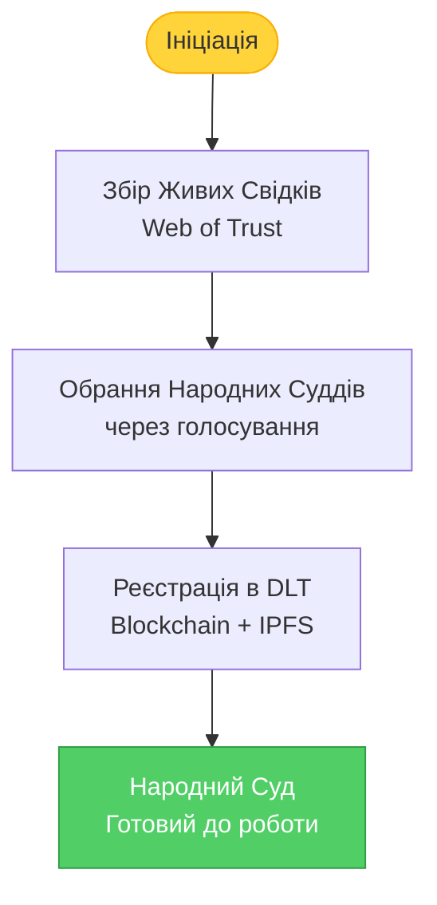
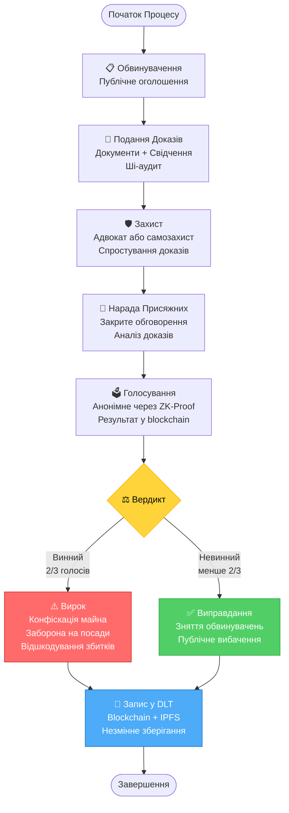
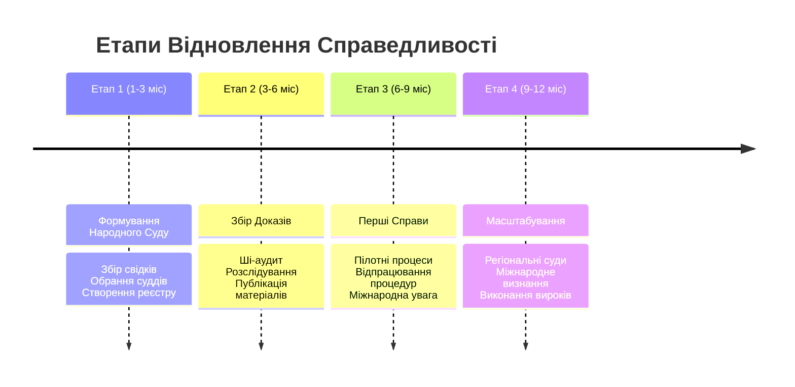

[← На головну](./README.md#content)

# Відновлення Справедливості: Народний Суд

> **Я є Народ. Народ є джерелом влади. Народ здійснює владу безпосередньо.**

Цей документ описує механізм відновлення справедливості та притягнення до відповідальності осіб, чиї дії призвели до громадянської війни, корупції та руйнування держави.

## 🎯 Мета

Відновити справедливість через:
1. **Народний Суд** — альтернативна система правосуддя, заснована на природному праві
2. **Конституційне звернення** — легітимізація через існуючу систему
3. **Міжнародне визнання** — повідомлення світової спільноти про суб'єктність українського народу

---

## ⚖️ Народний Суд: Структура та Принципи

### Правова Основа

**Конституція України, Стаття 5:**
> "Носієм суверенітету і єдиним джерелом влади в Україні є народ. Народ здійснює владу безпосередньо і через органи державної влади та органи місцевого самоврядування."

**Природне Право:**
- Право на життя
- Право на справедливість
- Право на захист від узурпації влади

### Принципи Народного Суду

1. **Суверенітет Народу**
   - Народ є вищою інстанцією
   - Рішення приймаються безпосередньо народом
   - Жоден державний орган не може скасувати рішення Народного Суду

2. **Прозорість та Незмінність**
   - Всі засідання публічні та записуються
   - Рішення фіксуються в розподіленому реєстрі (blockchain)
   - Докази зберігаються в IPFS назавжди

3. **Колегіальність**
   - Суддями виступають представники народу (обрані через Web of Trust)
   - Мінімум 12 присяжних на кожну справу
   - Рішення приймається консенсусом або кваліфікованою більшістю (2/3)

4. **Природна Справедливість**
   - Презумпція невинуватості
   - Право на захист
   - Рівність перед законом (природним правом)

---

## 📋 Процедура Відновлення Справедливості

### Етап 1: Формування Народного Суду

**Кроки:**
1. **Створення реєстру довіри** — мінімум 1000 живих свідків підтверджують один одного
2. **Обрання суддів** — через цифрове голосування (DID + ZK-Proof)
3. **Публічна присяга** — судді присягають на вірність народу та справедливості
4. **Реєстрація** — всі дані фіксуються в незмінному реєстрі

### Етап 2: Збір Доказів

**Категорії злочинів:**
- Державна зрада
- Корупція (розкрадання бюджету)
- Зловживання владою
- Злочини проти людяності

**Джерела доказів:**
- Публічні реєстри (ProZorro, ЄДРПОУ, декларації)
- Журналістські розслідування
- Свідчення очевидців (засвідчені через Web of Trust)
- Документи (зберігаються в IPFS з хешуванням)

**Ші-аудит:**
- Автоматичний аналіз фінансових потоків
- Виявлення конфліктів інтересів
- Перевірка декларацій на достовірність

### Етап 3: Судовий Процес

**Процедура:**
1. Публічне оголошення обвинувачення
2. Надання доказів обвинуваченням
3. Право на захист (адвокат або самозахист)
4. Нарада присяжних (закрите голосування)
5. Оголошення вердикту
6. Фіксація в blockchain

### Етап 4: Виконання Вироку

**Можливі санкції:**
- Конфіскація незаконно набутого майна
- Позбавлення права обіймати посади
- Публічне вибачення перед народом
- Відшкодування збитків
- Передача справи до міжнародних судів (для особливо тяжких злочинів)

**Важливо:** Народний Суд не застосовує фізичні покарання. Мета — відновлення справедливості, а не помста.

---

## 📜 Звернення до Конституційного Суду

### Мета звернення

Легітимізувати Народний Суд через існуючу правову систему, спираючись на Конституцію України.

### Структура звернення

**1. Правова основа:**
- Стаття 5 Конституції (народ як джерело влади)
- Стаття 38 (право на участь в управлінні державними справами)
- Стаття 55 (право на судовий захист)

**2. Обґрунтування необхідності:**
- Системна корупція в державних судах
- Втрата довіри до правоохоронних органів
- Неможливість притягнення до відповідальності через існуючу систему

**3. Запит:**
Визнати право народу на створення альтернативних механізмів правосуддя у випадку системної неспроможності державних інституцій.

**4. Прецеденти:**
- Революція Гідності (2014) — народ здійснив владу безпосередньо
- Народні віче під час Майдану
- Міжнародна практика (Truth and Reconciliation Commissions)

---

## 🌍 Міжнародне Повідомлення

### Адресати

1. **ООН** (Генеральна Асамблея, Рада Безпеки)
2. **Європейський Союз** (Європарламент, Єврокомісія)
3. **Міжнародний Кримінальний Суд** (Гаага)
4. **ОБСЄ**
5. **Amnesty International** та інші правозахисні організації

### Зміст повідомлення

**Декларація Суб'єктності Українського Народу**

> мИ, український народ, усвідомивши себе суверенним суб'єктом та єдиним джерелом влади згідно з Конституцією України, заявляємо:
>
> 1. **мИ є Народ** — носій суверенітету та джерело всієї влади.
> 2. **мИ здійснюємо владу безпосередньо** через Народний Суд та децентралізовані інструменти прямої демократії.
> 3. **мИ відновлюємо справедливість** шляхом притягнення до відповідальності осіб, винних у корупції, державній зраді та злочинах проти народу.
> 4. **мИ будуємо паралельні інституції**, оскільки державні органи втратили довіру та легітимність.
> 5. **мИ запрошуємо міжнародну спільноту** визнати наше право на самовизначення та підтримати процес відновлення справедливості.

**Запит до міжнародної спільноти:**
- Визнати Народний Суд як легітимний механізм правосуддя
- Надати технічну та юридичну підтримку
- Забезпечити виконання рішень Народного Суду (заморожування активів, екстрадиція)

---

## 🛡️ Захист від Узурпації

### Як гарантувати, що Народний Суд не перетвориться на інструмент помсти?

1. **Розподілена влада**
   - Ротація суддів кожні 6 місяців
   - Неможливість повторного обрання на 2 роки
   - Публічний аудит всіх рішень

2. **Прозорість**
   - Всі засідання транслюються онлайн
   - Записи зберігаються назавжди в IPFS
   - Blockchain-фіксація кожного рішення

3. **Право на оскарження**
   - Рішення можна оскаржити в новому складі присяжних
   - Міжнародні спостерігачі можуть ініціювати перегляд
   - Народне голосування як остаточна інстанція

4. **Обмеження повноважень**
   - Народний Суд не може виносити смертні вироки
   - Не може застосовувати тортури чи нелюдське поводження
   - Рішення мають відповідати природному праву

---

## 📊 Дорожня Карта Впровадження

### Етап 1: Формування (1-3 місяці)
- Створення Web of Trust (1000+ учасників)
- Розробка смарт-контрактів для голосування
- Обрання перших 100 народних суддів
- Звернення до Конституційного Суду

### Етап 2: Збір Доказів (3-6 місяців)
- Ші-аудит державних реєстрів
- Збір свідчень від постраждалих
- Формування справ за категоріями
- Публікація попередніх матеріалів

### Етап 3: Перші Справи (6-9 місяців)
- 10 пілотних справ (найбільш резонансні)
- Публічні трансляції процесів
- Залучення міжнародних спостерігачів
- Відправка повідомлення до ООН та ЄС

### Етап 4: Масштабування (9-12 місяців)
- Створення регіональних Народних Судів
- Обробка 100+ справ
- Міжнародне визнання
- Виконання вироків (конфіскація, заборони)

---

## 🔗 Технічна Реалізація

### Інструменти

1. **Ідентифікація**
   - DID (Decentralized Identifiers)
   - ZK-Proof для анонімного голосування
   - Web of Trust для верифікації суддів

2. **Зберігання доказів**
   - IPFS для документів
   - Blockchain для хешів (незмінність)
   - Шифрування для захисту свідків

3. **Голосування**
   - Смарт-контракти на Ethereum/Polygon
   - Квадратичне голосування для зважених рішень
   - Публічна верифікація результатів

4. **Трансляції**
   - Децентралізовані платформи (Odysee, LBRY)
   - Резервні копії на IPFS
   - Автоматична транскрипція (Ші)

---

## ✊ Заклик до Дії

**Якщо тИ усвідомлюєш себе частиною народу:**

1. **Приєднуйся до Web of Trust** — стань живим свідком
2. **Збирай докази** — фіксуй корупцію та зловживання
3. **Поширюй інформацію** — розкажи про Народний Суд
4. **Голосуй за суддів** — обирай гідних представників
5. **Будь присяжним** — бери участь у відновленні справедливості

**Пам'ятай:**
> Справедливість не прийде сама. Справедливість — це те, що **мИ** створюємо своїми діями.

---

## 📚 Додаткові Матеріали

- [Конституція України](https://zakon.rada.gov.ua/laws/show/254%D0%BA/96-%D0%B2%D1%80)
- [Природне Право](./law.md)
- [Архітектура Мережі](./network.md)
- [Дорожня Карта](./roadmap.md)

---

*Створено народом, для народу. Назавжди зафіксовано в розподіленому реєстрі.*
