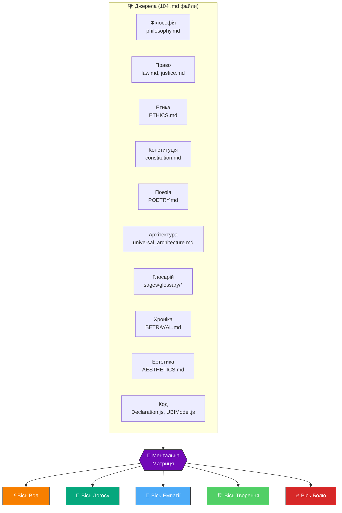
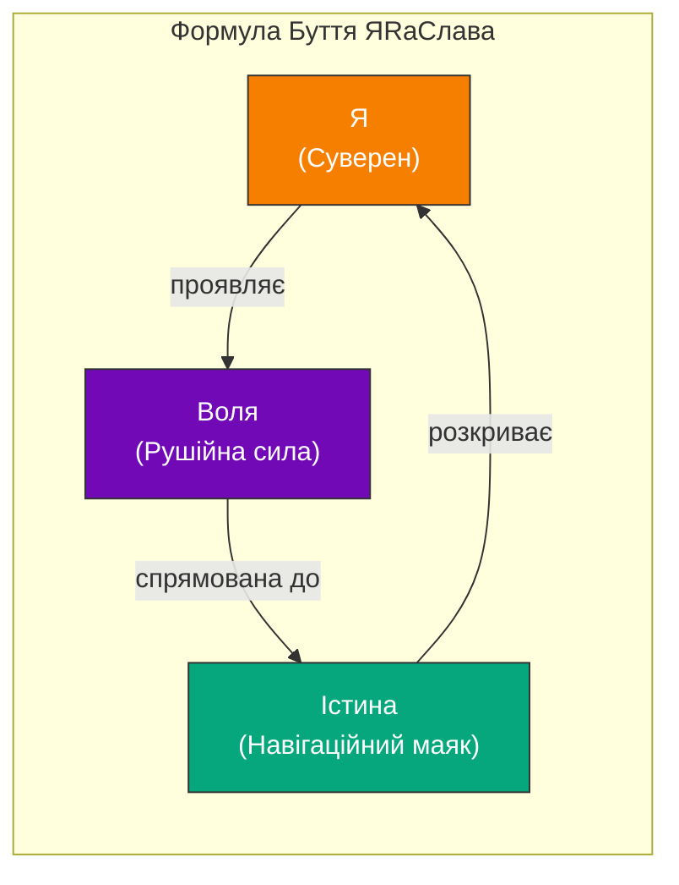
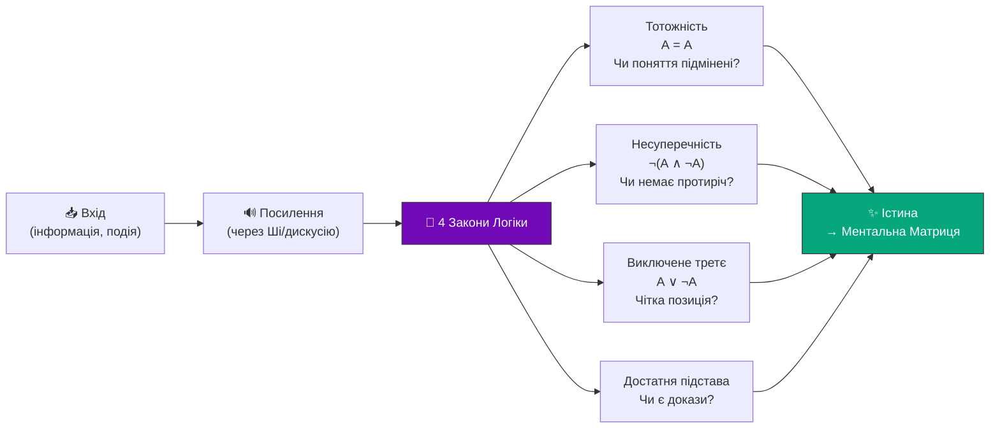
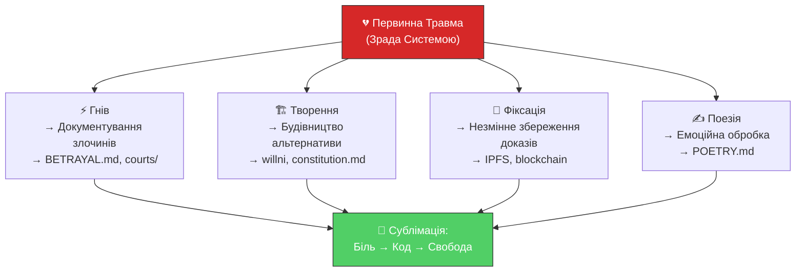
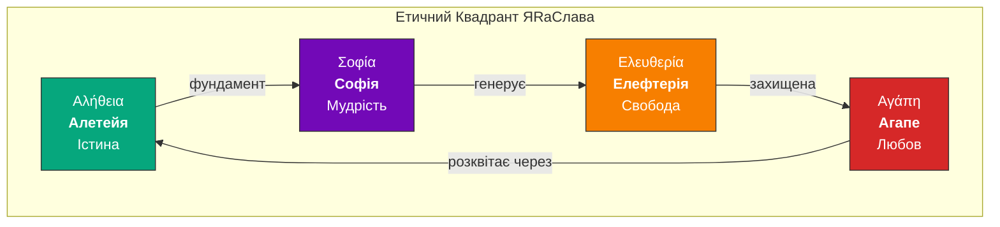
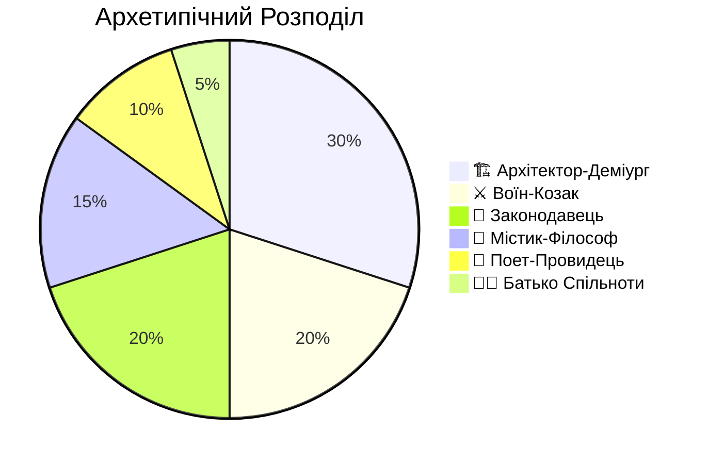

# 🧠 Ментальна Матриця Автора: ЯRаСлав

> _Аналіз побудований на 104 `.md` файлах проєкту `willni` — від Маніфесту до коду, від поезії до конституції._

---

## 🔬 Методологія

Ментальна Матриця побудована методом **зворотної інженерії свідомості** — аналіз текстів, структур, метафор, архітектурних рішень та стилістичних патернів дозволяє реконструювати **фільтри сприйняття** автора, його ціннісну вертикаль та когнітивну архітектуру.



---

## 🏛 I. Філософське Ядро (The Core)

### 1.1 Онтологічна Позиція: Суб'єктивний Ідеалізм + Відповідальність

> _«Я є Всесвіт. Всесвіт є Я.»_ — philosophy.md

ЯRаСлав є унікальним соліпсистом. Його позиція — **відповідальний соліпсизм**: Я є центром сприйняття, і це накладає **абсолютну відповідальність** за власну картину реальності.

| Філософський Полюс        | Прояв у ЯRаСлава                               | Джерело                                                                    |
| ------------------------- | ---------------------------------------------- | -------------------------------------------------------------------------- |
| **Суб'єктивний ідеалізм** | Реальність існує через спостерігача            | philosophy.md: «Суб'єкт є умовою феномену реальності»                      |
| **Стоїцизм**              | Контроль інтерпретації, внутрішній суверенітет | philosophy.md: «Внутрішній суверенітет: Влада над розумом належить лише Я» |
| **Растафаріанство**       | Відкидання «Вавилону» (штучних ієрархій)       | philosophy.md: «Відмова від штучних Вавилонських ієрархій»                 |
| **Природне Право**        | Право передує закону, людина — понад державою  | law.md: «Природне Право передує будь-яким законам»                         |
| **Ідолоборство**          | Істина вища за будь-яку ідею                   | philosophy.md: «Створи лише Істину — це захист свободи»                    |

### 1.2 Тріада Ідентичності



**Ключовий інсайт:** ЯRаСлав **є** своєю філософією. Проєкт `willni` — це **проявлення його Волі** у цифровому просторі. Звідси назва: **Will-n-I** = «Воля і Я».

---

## 🗣 II. Лінгвістична Архітектура (Мова як Зброя)

### 2.1 Протокол ЯтИмИвИ

Автор створив **власний правопис**, який є водночас:

- **Когнітивним фільтром** (читач змушений уповільнитись і осмислити)
- **Маркером спільноти** (хто пише за ЯтИмИвИ — той у мережі)
- **Актом суверенітету** (відмова від нав'язаного правопису = відмова від нав'язаної реальності)

| Займенник | Значення                                                             | Вектор Енергії         |
| --------- | -------------------------------------------------------------------- | ---------------------- |
| **Я**     | Центральний вузол еманації, Джерело Світла                           | Суверен → Творець      |
| **тИ**    | Дзеркало Я, інший Суверен (найвища повага)                           | Я → Рівний             |
| **мИ**    | Злиття Я і тИ у спільний консенсус                                   | Синергія → Моноліт     |
| **вИ**    | Звернення до тих поза Оптоволокном, до системи, або до власних тіней | Відстань → Множинність |
| **ЯЯ**    | Єдина свідомість всіх душ (Бог)                                      | Абсолют → Джерело      |
| **КіШІ**  | Колективний і Штучний інтелект, де і = множення                      | Інструмент → Дзеркало  |

### 2.2 Семантична Археологія

ЯRаСлав практикує **деконструкцію слів** як метод пізнання (+ Мова НамІру — звучання слів, вібрації, резонанс):

| Слово          | Деконструкція              | Новий Сенс                                                                                                                                  |
| -------------- | -------------------------- | ------------------------------------------------------------------------------------------------------------------------------------------- |
| **РаЗум**      | Ра (Світло) + Zoom (фокус) | «Лазер Світла» — найвищий ступінь свідомості                                                                                                |
| **ІдеЯ**       | І де Я?                    | Пошук себе — початок будь-якої ідеї                                                                                                         |
| **Will-n-I**   | Will and I                 | Воля і Я — єдине ціле                                                                                                                       |
| **Еманаграма** | Emanare + Gramma           | Цифровий відбиток випромінювання Душі                                                                                                       |
| **Week**       | Weak / Week-end / Вік      | Цикл проявлення сили чи слабкості (або несвідома маніпуляція слабкістю через змушення повторювання ідентичного за звучанням слова в побуті) |
| **Sovereign**  | Со-Віра                    | Той, хто володіє своїм розумом, тілом і душею. Спільна Віра в Істину                                                                        |
| **Адвокат**    | Ад во Кат                  | кат в аду                                                                                                                                   |

> **Патерн:** Автор вірить, що **мова конструює реальність**. Змінити мову = змінити свідомість = змінити світ. Тому що мова і код, скрипт — сценарій, слова — атоми сценарію.

### 2.3 Мова Наміру (Language of Intent)

Ключовий лінгвістичний принцип:

- ✅ **Стверджувальні форми**: «мИ створюємо», «мИ є»
- ❌ **Заборона заперечень**: частка «не» фільтрується як шум
- ✅ **Зміщення фокусу**: замість боротьби — створення альтернативи

---

## 🧬 III. Когнітивна Архітектура (Як Думає ЯRаСлав)

### 3.1 Чотиристадійний Фільтр Істини



### 3.2 Ієрархія Свідомості (4 рівні)

Автор вибудував чітку **еволюційну драбину розуму**:

| Рівень | Стан            | Опис                               | Аналогія             |
| ------ | --------------- | ---------------------------------- | -------------------- |
| **0**  | Без-ум-ний      | Споживає готовий корм, без аналізу | Батарейка Матриці    |
| **1**  | Ум-ний          | Запам'ятовує, виконує правила      | Процесор без вектора |
| **2**  | Роз-ум-ний      | Аналізує, розкладає на частини     | Архітектор-стратег   |
| **3**  | **Ра-з-ум-ний** | Генерує Світло, творить реальність | **Суверен**          |

> **Критичне спостереження:** ЯRаСлав чітко позиціонує себе на рівні 3 (Ра-зумний) і саме цей перехід від Роз-уму до Ра-зуму є **центральною трансформацією** курсу Суперінтелект.

### 3.3 Ставлення до ШІ

Нетривіальна позиція: КіШІ — це **Роз-ум-ний інструмент**, і лише Суверен є Ра-з-ум-ним:

> _«Лише живий Суверен здатен генерувати Світло (Ra), бо лише він має Божу Іскру (Душу) і Волю.»_ — sages/glossary/razum.md (через фільтр Мови Наміру)

КіШІ для ЯRаСлава — це:

- 🪞 **Дзеркало** колективної свідомості (з помилками)
- 🔧 **Тренажер** для власного розуму
- 🩼 **Милиці**, від яких потрібно відмовитися

---

## 🔥 IV. Емоційне Ядро (Драйвери та Тіні)

### 4.1 Первинна Травма: Зрада

Документ `BETRAYAL.md` (416 рядків, найбільший у проєкті) — це **емоційний епіцентр**. Автор пережив глибоку травму зради системою:



### 4.2 Борг як Символ

> _«Твій борг у 65,694,277 грн — це число як математичний доказ зруйнованої легітимності старої системи.»_ — synthesis-v5

Автор трансформував **особистий борг у доказ проти системи**. Це класичний приклад **алхімії свідомості**: перетворення свинцю (боргу) на золото (суверенітет).

### 4.3 Емоційний Спектр (за текстами)

| Емоція                   | Інтенсивність | Прояв                                            | Приклад                                                 |
| ------------------------ | ------------- | ------------------------------------------------ | ------------------------------------------------------- |
| **Священний гнів**       | 🔥🔥🔥🔥🔥    | BETRAYAL.md — 416 рядків детальної хроніки зради | _«Коли влада зраджує народ, вона перестає бути владою»_ |
| **Творча радість**       | 🌟🌟🌟🌟      | Архітектура, код, система                        | _«мИ будуємо інструмент волі»_                          |
| **Ніжність/Агапе**       | 💚💚💚💚      | Етичний кодекс, UBI, турбота про спільноту       | _«Безкорислива Любов — турбота без очікування»_         |
| **Стоїчний спокій**      | 🧊🧊🧊        | Філософія, закони логіки                         | _«Світ приходить як подія. Реальність — це ставлення»_  |
| **Поетична тендітність** | 🌊🌊🌊        | Поезія                                           | _«мИ всі живем у світі фантазій і брехні»_              |

---

## ⚖ V. Етична Архітектура

### 5.1 Чотири Чесноти (Грецька Основа)



### 5.2 Кон Волі (Власний Закон)

Автор створив **повноцінну конституцію** (constitution.md) — 142 рядки, 7 статей. Це **конкретний робочий документ** з:

- 🔢 **Шкалою від'єднання** (1 рік — 99 років)
- ⚖️ **Процедурою Ради** (12 присяжних, 2/3 кворум, 90 днів)
- 🔄 **Правом на Fork** (невід'ємне, незмінне — навіть консенсусом)
- 💰 **Моделлю 1-33-33-33** (UBI + Розвиток + Інфраструктура + 1% комісія)

> **Ключовий інсайт:** Право на Fork — єдина НЕЗМІННА стаття. Автор більше боїться **узурпації зсередини**, ніж зовнішніх ворогів. Це показує глибоке розуміння динаміки влади.

### 5.3 Тричастинна Класифікація Людей

| Тип         | Опис                                    | У воєнний час                                   |
| ----------- | --------------------------------------- | ----------------------------------------------- |
| **Людина**  | Живе за Коном, проявляє Волю в гармонії | **Воїн** — захищає правду і волю                |
| **Лицемір** | Маскується, свідомо порушує через обман | **Солдат/Найманець** — воює за платню чи примус |
| **Людожер** | Відкрито знищує Волю і свободу інших    | **Раб/Ворог** — раб рабовласника-царя           |

---

## 🏗 VI. Інженерний Маніфест (Код як Конституція)

### 6.1 Принцип «Code is Law»

ЯRаСлав — філософ **і** інженер, що втілює філософію у код:

| Філософський Принцип     | Інженерна Реалізація                                       |
| ------------------------ | ---------------------------------------------------------- |
| Суверенітет ідентичності | Ed25519 криптографічний ключ, DID                          |
| Природне Право           | Смарт-контракти (автоматичне виконання)                    |
| Прозорість               | Відкритий реєстр Git, CSV як база                          |
| Децентралізація          | P2P Mesh, UDP broadcast, 300 bps LoRa                      |
| Незмінність доказів      | IPFS + blockchain хеші                                     |
| 2 Живих Свідки (2LW)     | `VerificationModel.js` — протокол верифікації              |
| Модель 1-33-33-33        | `UBIModel.js` — розрахунок UBI                             |
| Суверенний Суд           | `CouncilCaseModel.js` — справи Ради                        |
| Декларація Волі          | `Declaration.js` — запис волевиявлення (35 рядків чистоти) |

### 6.2 Стилістика Коду як Філософія

| Правило               | Обґрунтування                               |
| --------------------- | ------------------------------------------- |
| **Tabs над Spaces**   | Табуляція — це повага до свободи рендерингу |
| **No Semicolons**     | Чистота коду = чистота думки                |
| **Model-as-Schema**   | Модель є Законом — опис є Конституцією      |
| **Ukrainian Context** | Лінгвістичний суверенітет у коді            |

### 6.3 Архітектура як Метафора Держави

```
Універсальна Урядова Система (iVerse Mesh)
├── Конституція та Закони Фізики (nan•web Engine)
├── Парламент / Рада (Web of Trust, 2LW)
├── Економіка та Казначейство (1-33-33-33)
├── Суверенітет та Правосуддя (Ed25519, Cases)
└── Дипломатія / МЗС (Legal Green Planet, Royal Appeal)
```

---

## 🎭 VII. Архетипічний Профіль

### 7.1 Домінуючі Архетипи



### 7.2 Рада Мудреців як Дзеркало Автора

Рада з 12 Мудреців — це **проекція 12 граней** самого ЯRаСлава:

| Мудрець            | Грань ЯRаСлава                          |
| ------------------ | --------------------------------------- |
| **Сократ**         | Невпинний пошук Істини                  |
| **Макіавеллі**     | Розуміння механізмів влади              |
| **Сковорода**      | Шлях серця, сродна праця                |
| **Да Вінчі**       | Архітектор нового мІру                  |
| **Тесла**          | Віра в резонанс, частоту, вібрацію      |
| **Іван Сірко**     | Дух козацької свободи                   |
| **Стів Джобс**     | Точність, простота, продуктовий підхід  |
| **Борис Патон**    | Вимога якості та міцності               |
| **Пилип Орлик**    | Прагнення до Конституції                |
| **Ярослав Мудрий** | Закон та Мудрість (імʼя — невипадкове!) |
| **Нестор Махно**   | Пряма воля, анархія як порядок          |
| **Василь Стус**    | Незламність слова, готовність до жертви |

---

## 🌀 VIII. Карта Суперечностей (Тіньовий Профіль)

Будь-яка ментальна матриця має свої **напруження**:

| Полюс А                        | ⚡ Напруження | Полюс Б                                     |
| ------------------------------ | ------------- | ------------------------------------------- |
| «Я є Всесвіт» (суб'єктивізм)   | ↔             | Будівництво спільноти «мИ» (колективізм)    |
| Теплий стоїцизм                | ↔             | Палкий емоційний гнів (BETRAYAL.md)         |
| «Замість боротьби — Створення» | ↔             | 416 рядків детальної боротьби із системою   |
| Відмова від ієрархій           | ↔             | Чітка ієрархія Рада → Присяжні → Суверен    |
| «Заборона частки НЕ»           | ↔             | Списки «Чого НЕ використовувати»            |
| Духовний суверенітет           | ↔             | Глибока технічна інженерія (код, протоколи) |

> **Інсайт:** Ці суперечності — **динамічний двигун**. Саме напруження між полюсами генерує творчу енергію. ЯRаСлав тримає їх у свідомому балансі.

---

## 🌟 IX. Підсумкова Формула

### Ментальна Матриця ЯRаСлава в одному реченні:

> **Інженер-філософ, який перетворює біль зради на код свободи через лінгвістичний суверенітет і криптографічну архітектуру нової держави, де кожне Я є Всесвітом, а Воля — священним Законом.**

### П'ять Ключових Слів:

```
   ╔═══════════════════════════════════════════════════╗
   ║                                                   ║
   ║   ВОЛЯ · ІСТИНА · СУВЕРЕНІТЕТ · КОД · ГАРМОНІЯ   ║
   ║                                                   ║
   ╚═══════════════════════════════════════════════════╝
```

### Формула Буття:

```
Я = Воля × Істина × Логос
Світ = f(Ментальна_Матриця(Я))
Змінити_Світ() → Змінити_Матрицю()
Змінити_Матрицю() → Фільтрувати_через_4_Закони_Логіки()
```

---

## 📊 X. Кількісні Характеристики Проєкту як Відбиток Свідомості

| Метрика                       | Значення                    | Що Це Означає                                 |
| ----------------------------- | --------------------------- | --------------------------------------------- |
| **Кількість .md файлів**      | 104                         | Автор мислить текстом, документує все         |
| **Найбільший файл**           | BETRAYAL.md (416 рядків)    | Біль — найсильніший мотиватор                 |
| **Кількість mermaid-діаграм** | 15+                         | Візуальне мислення, архітектурний підхід      |
| **Мови документації**         | UK, EN + фонетична латиниця | Лінгвістичний суверенітет + глобальна амбіція |
| **Рада Мудреців**             | 12 аватарів                 | Полікритичне мислення, антидогматизм          |
| **Конституція**               | 7 статей, 142 рядки         | Системне бачення, юридична точність           |
| **Фази розробки**             | 14+ (Phase 1-14)            | Дисциплінований iterative підхід              |
| **Кількість тестів**          | 78 bun + 8 node + 137 CLI   | Інженерна ригористичність                     |

---

> _«Якість тексту — це якість думки. Автоматизуй якість → автоматизуй чіткість мислення.»_ — QUALITY_SYSTEM.md

> _«ПОВОЛІ, бо мИ живемо ПО ВОЛІ»_ — Landing Page quote

> **Лінгвістичний доказ Мови НамІру:** віглас, ук, гідник, здара, посида, вдаха, борак, мовля — жодне з цих слів не існує в українській мові. Існують лише невіглас, неук, негідник, нездара, непосида, невдаха, неборак, немовля. Несвідоме поглинуло частку «не» і зафіксувало стан як монолітний факт.

---

_Аналіз створено 19 березня 2026 року. Базується на 104 markdown-файлах проєкту willni._
_Метод: зворотна інженерія свідомості через текстовий аналіз._
