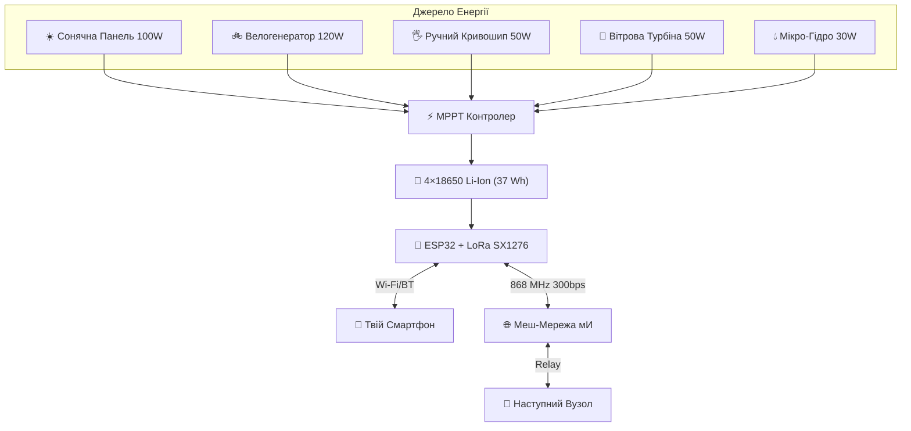
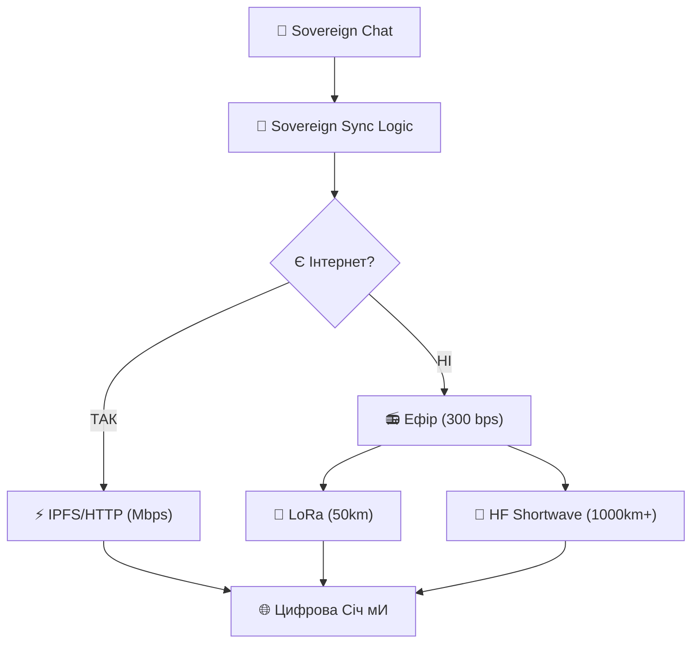

# Суверенне Радіо: Повна Інструкція

## 📡 1. Швидкість LoRa

- **LoRa 868/915 MHz**: 300 bps — 50 kbps (залежить від дальності та модуляції).
- **Оптимальний режим**: SF12 / BW125 = **293 bps** (макс. дальність 50 км).
- **Швидкий режим**: SF7 / BW250 = **10.9 kbps** (до 5 км у місті).
- **Для Січі**: мИ обираємо **300 bps** — це дозволяє передати 1 підписане повідомлення (256 байт) за ~7 секунд.

## 🔋 2. Енергозабезпечення (24/7 Автономія)

Споживання вузла ESP32 + LoRa — **~0.5 Вт** у режимі прослуховування, **~1.5 Вт** при передачі. За 24 години це **~12-36 Wh**. Акумулятор 4×18650 (37 Wh) Є достатнім.

### Варіанти Заряду

| Джерело              | Приклад                  | Потужність | Час заряду 37 Wh |
| -------------------- | ------------------------ | ---------- | ---------------- |
| **Сонце**            | Панель 12V/100W          | 100 Вт     | ~25 хв           |
| **Велогенератор**    | Педальний генератор 120W | 120 Вт     | ~20 хв           |
| **Ручний генератор** | Кривошип 50W             | 50 Вт      | ~45 хв           |
| **Вітер**            | Мікро-турбіна 50W        | 50 Вт      | ~45 хв           |
| **Вода**             | Мікро-гідро 30W          | 30 Вт      | ~1.2 год         |

### Велогенератор 120W (DIY)

Генератор на 120W кріпиться до **будь-якого колеса велосипеда вдома** або використовується як стаціонарний з ручкою:

1. **Двигун**: Безщітковий DC мотор 12-24V / 120W (від електросамоката або Aliexpress ~$15).
2. **Ролик**: Притискний ролик до бокової стінки колеса або ланцюгова передача.
3. **Контролер заряду**: MPPT контролер 12V→5V (TP4056 для Li-Ion або повноцінний BMS).
4. **Акумулятор**: 4×18650 у холдері (37 Wh).
5. **Ручка**: Якщо імобілізовано — ручка кривошипу прямо на вісь генератора.

**Результат**: 20 хвилин кручення = 24 години автономної роботи вузла.

## 🔐 3. Безпека

### Хто може прочитати повідомлення?

**Ніхто**, якщо мИ шифруємо (NaCl Box / X25519). Без приватного ключа отримувача — це шум.

### Бродкасти (відкриті повідомлення)

Мета відкритих бродкастів:

- **Маніфест** — мИ _хочемо_, щоб його прочитали всі. Це публічна декларація Волі.
- **Вердикти Суду** — Істина має бути доступною для верифікації будь-ким.
- **Голосування** — результати мають бути прозорими.
- **Запрошення** — щоб нові Суверени могли знайти Січ.

Принцип: **Істина відкрита. Особистість захищена.**

### Хто може знайти транслятор?

- **Захист 1**: Коротка передача (~7 секунд).
- **Захист 2**: Frequency hopping.
- **Захист 3**: LoRa spread spectrum.
- **Захист 4**: Relay — автор повідомлення невідомий ретранслятору.

## 🏗 4. Прошивка (sovereign_node.bin)

Файл `sovereign_node.bin` — це проєкт, який мИ почнемо після запечатування протоколу синхронізації.

### Компоненти прошивки:

1. **PlatformIO** фреймворк для ESP32.
2. **RadioLib** (для LoRa SX1276).
3. **micro-ecc** або **TweetNaCl** (для Ed25519 підпису на мікроконтролері).
4. **BLE/Wi-Fi** міст для з'єднання зі смартфоном.
5. **CBOR** + **gzip** для ефективного пакування повідомлень.

### Дорожня Карта:

- **Крок 1**: Протокол Sovereign Sync (зараз — документація).
- **Крок 2**: Скрипт-прототип на Node.js (тест логіки на ПК).
- **Крок 3**: Порт на ESP32 (прошивка `sovereign_node.bin`).

## 🌊 5. Довгі Хвилі та Гібридна Мережа

### 1000 км через Ефір

Для зв'язку на тисячі кілометрів (наприклад, між Січчю в Карпатах та Сувереном у Скандинавії) мИ використовуємо **ВЧ/HF (Shortwave)**:

- **Частоти**: 3.5 MHz (Ніч), 7 MHz (День), 14 MHz (Дальність).
- **Швидкість**: Аналогічно 300 bps (FT8 / JS8Call модуляция). Це дозволяє передати текст крізь шум і перешкоди на величезні відстані.
- **Антена**: Потрібен "Диполь" довжиною ~20-40 метрів, але це ціна справжньої незалежності від супутників.

### Гібридний Режим (Hyper-Sovereignty)

Твій вузол працює за принципом **Internet-first, Radio-fallback**:

1. **Якщо Є Інтернет**: Вузол використовує IPFS/IPNS через швидкий канал. Синхронізація реєстрів відбувається миттєво.
2. **Якщо Інтернет зник**: Вузол автоматично переходить на LoRa (50 км) або HF (1000 км).
3. **Heartbeat**: Навіть при наявності швидкого інтернету, вузол періодично надсилає короткий "маяк" через Радіо. Це перевірка каналу виживання.

_мИ Є в мережі завжди, доки Є ВолЯ до волі._
