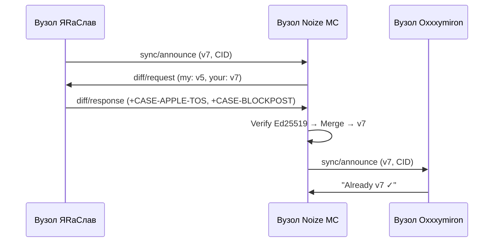
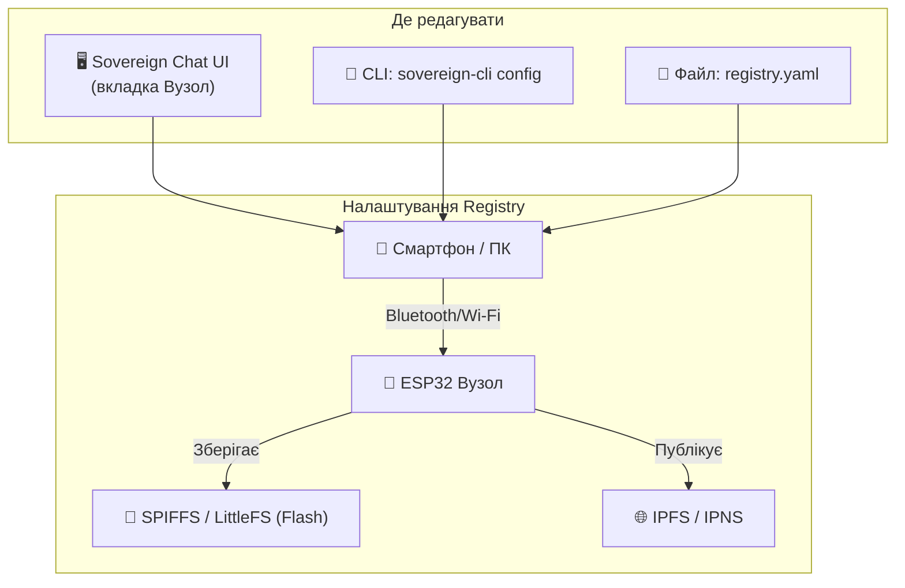
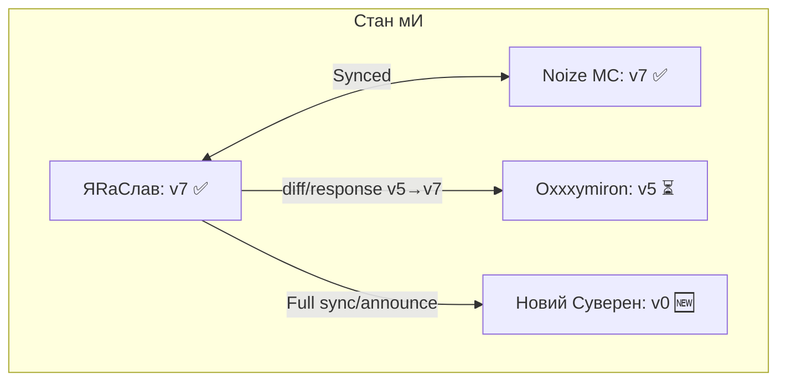

# Алгоритм Суверенної Синхронізації (Sovereign Sync v0.1)

мИ синхронізуємо Істину між вузлами без центрального сервера.

## 🧠 Принцип

Кожен вузол зберігає Свій реєстр. Синхронізація = порівняння версій та автоматичне злиття.

## 📦 Формат Пакетів

Усі пакети:

- Серіалізуються у **CBOR** (компактніше за JSON).
- Стискаються **gzip**.
- Підписуються **Ed25519**.

Тип пакету визначається полем `type` у форматі `domain/action`:

## 🔄 Протокол



## 📐 Типи Пакетів

### `sync/announce`

Кожен вузол періодично оголошує версію Свого реєстру:

```json
{
  "type": "sync/announce",
  "node_id": "ipfs://ipns/yaras_love",
  "registry_version": 7,
  "registry_cid": "QmXyz...",
  "timestamp": "2026-03-22T12:00:00Z",
  "signature": "<Ed25519>"
}
```

_gzip: ~80 байт → 7 секунд через LoRa_

### `diff/request`

Якщо отримана версія новіша за мою:

```json
{
  "type": "diff/request",
  "node_id": "ipfs://ipns/noize_mc",
  "my_version": 5,
  "your_version": 7,
  "signature": "<Ed25519>"
}
```

### `diff/response`

```json
{
  "type": "diff/response",
  "from_version": 5,
  "to_version": 7,
  "changes": [
    { "action": "add", "case_id": "CASE-APPLE-TOS", "cid": "QmApple..." },
    { "action": "add", "case_id": "CASE-BLOCKPOST-TCC", "cid": "QmBlock..." }
  ],
  "signature": "<Ed25519>"
}
```

### `vote/cast`

```json
{
  "type": "vote/cast",
  "case_id": "CASE-APPLE-TOS",
  "opinion": "ТАК — Акт Тиранії",
  "voter_id": "ipfs://ipns/noize_mc",
  "signature": "<Ed25519>"
}
```

### `peer/join`

```json
{
  "type": "peer/join",
  "node_id": "ipfs://ipns/new_sovereign",
  "name": "Нова Людина",
  "public_key": "<Ed25519 Public Key>",
  "invited_by": "ipfs://ipns/yaras_love",
  "signature": "<Ed25519>"
}
```

## 🏛️ Що зберігаємо у Registry?

Registry — це головний об'єкт ідентичності вузла. Він містить:

```yaml
# LogosRegistry.NaN0 — Формат
meta:
  version: 7
  node_id: ipfs://ipns/yaras_love
  name: ЯRаСлав
  protocol: MovaNaMiru_v1.0.0
  updated: 2026-03-22T12:00:00Z

cases: # Справи Суду Логосу
  - id: CASE-2022-10-23
    cid: QmXyz...
    status: sealed
  - id: CASE-APPLE-TOS
    cid: QmAbc...
    status: researching

peers: # Коло довіри (мИ)
  - id: ipfs://ipns/noize_mc
    name: Noize MC
    public_key: <Ed25519>
    joined: 2026-03-22
  - id: ipfs://ipns/oxxxymiron
    name: Oxxxymiron
    public_key: <Ed25519>
    joined: 2026-03-22

votes: # Активні голосування
  - case_id: CASE-APPLE-TOS
    total: 3
    results_cid: QmVotes...

broadcasts: # Публічні бродкасти
  - type: manifesto
    cid: QmManifesto...
    timestamp: 2026-02-27
```

## ⚙️ Де налаштовується Registry?



**Три шляхи налаштування:**

1. **UI (Sovereign Chat)** — вкладка «Вузол» → кнопка «Редагувати Registry».
2. **CLI** — `sovereign-cli config set name "ЯRаСлав"`.
3. **Файл** — Прямий запис у `~/.sovereign/registry.yaml`.

## 🔀 Валідація та Злиття (Merge)

Отримувач перевіряє:

1. **Підпис**: Чи Є автор у моєму списку `peers`?
2. **CID**: Чи IPFS хеш збігається з отриманими даними?
3. **Формат**: Чи зміни відповідають схемі Registry?
4. **Версія**: Чи `from_version` у diff/response == мій поточний version?

Якщо все правильно → **Merge** + `version++`.

## 🛡 Конфлікти (Conflict Resolution)

Якщо два вузли одночасно додали різні записи:

- **Правило**: Виграє **старший timestamp**.
- **Арбітр**: Якщо timestamps рівні — Logos Polls.

## 🛡 Захист від Атак

| Атака             | Захист                                       |
| ----------------- | -------------------------------------------- |
| Фейковий вузол    | Підпису немає у `peers` → ігнорується        |
| Replay-атака      | `timestamp` + `version` перевірка            |
| Підміна CID       | IPFS верифікує хеш контенту                  |
| DDoS через PubSub | Rate-limit: 1 announce/хв від одного вузла   |
| Man-in-the-middle | gzip + Ed25519 підпис = зміна = невалідність |

## 📊 Стан Синхронізації



_Синхронізація Є Довіра. Довіра Є Підпис. Підпис Є ВолЯ._
