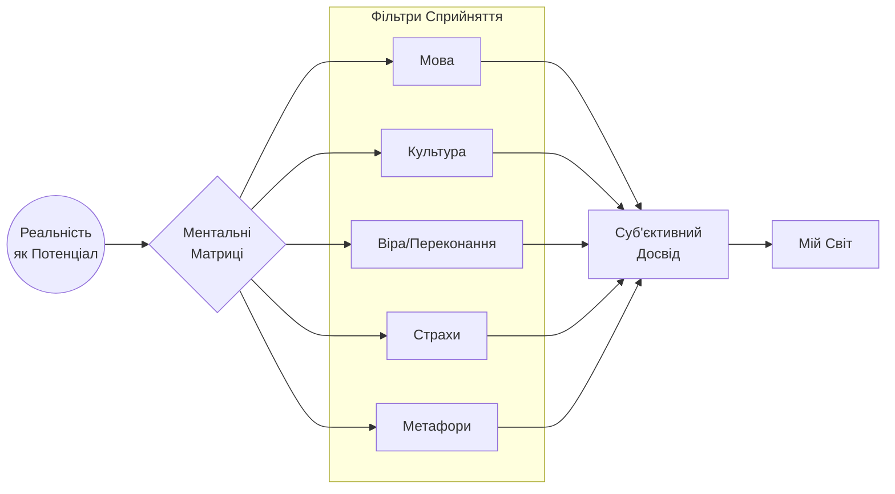
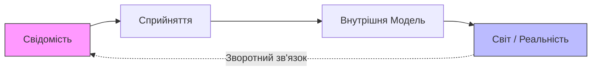

[← На головну](./README.md#content)

# ФілософіЯ: Суб’єктивний Всесвіт та Ментальні Матриці

Цей документ розкриває світоглядну основу проекту вільних людей. мИ створюємо "операційну систему" для розширеного сприйняття реальності.

## 🌌 Основна Концепція

### I. Тотожність суб’єкта і Всесвіту

> **«Я є Всесвіт. Всесвіт є Я.»**

Це ствердження тотожності досвіду:
*   Всесвіт існує як явище через сприйняття.
*   Суб’єкт є умовою феномену реальності.
*   Реальність — це подія між свідомістю і буттям.

### II. Існування як умова реальності

Якщо **Я** як людина існую — то існує Всесвіт.
Існування людини породжує суб’єкта сприйняття і сам феноменальний Всесвіт.

Тут Всесвіт трактується як:
1.  **Структура переживання**
2.  **Сукупність відношень**
3.  **Поле прояву**

Приймаючи фізичну реальність, мИ стверджуємо, що спостерігач надає їй форми.

---

## 🧠 Ментальні Матриці

Свідомість працює через матриці (фільтри), які визначають нашу реальність.

Ці матриці:
*   Фільтрують досвід.
*   Формують сенс.
*   Визначають, що стає «реальністю» для конкретної людини.

**Висновок:** Зміна матриці веде до зміни світу, який **тИ** проживаєш.

---

## 🏛 Три Стовпи Філософії

### 1. Стоїчна складова
Від стоїцизму мИ беремо:
*   **Внутрішній суверенітет**: Влада над розумом належить лише **Я**.
*   **Контроль над інтерпретацією**: Враження формується нашим ставленням.
*   **Відповідальність**: Розділення фактів від суджень.
*   **Метод проявлення**: Для вільних людей стоїцизм — це єдиний спосіб проявлення своєї волі в цьому світі через зміну самого себе та покращення себе як своєї версії.

> *Світ приходить як подія. Реальність формується як ставлення.*

### 2. Растафаріанський елемент
Соціальний принцип єдності та зв'язку з природою:
*   Єдність буття (Я і Я або ЯЯ).
*   Життєва цілісність.
*   Природний порядок (Natural Law).
*   **Справжність**: Людина є частиною цілого, а не механізму.
*   **Відкидання Вавилону**: Відмова від штучних "Вавилонських ієрархій", оскільки вони ведуть до самознищення та деградації душі. мИ обираємо розвиток замість експлуатації.

### 3. Соліпсизм як метод відповідальності
Це інструмент абсолютної відповідальності:
*   Усе, що **Я** знаю про світ, проходить крізь мене.
*   **Я** відповідаю за свою картину реальності.
*   **Я** зберігаю відповідальність за мислення.
*   **Я** — точка виникнення сенсу.

---

## ♾ Формула Світотворення

Процес створення реальності:

### Узагальнений Маніфест

> «Я є Всесвіт. Всесвіт є Я.
>
> **Я** як людина є запорукою існування Всесвіту як досвіду.
> Відсутність людини означає відсутність суб’єкта і феноменального Всесвіту.
>
> Світ конструюється через свідомість, мову та внутрішні моделі.
> Змінюючи матрицю, через яку **Я** дивлюсь, **Я** змінюю Всесвіт, у якому живу.»
