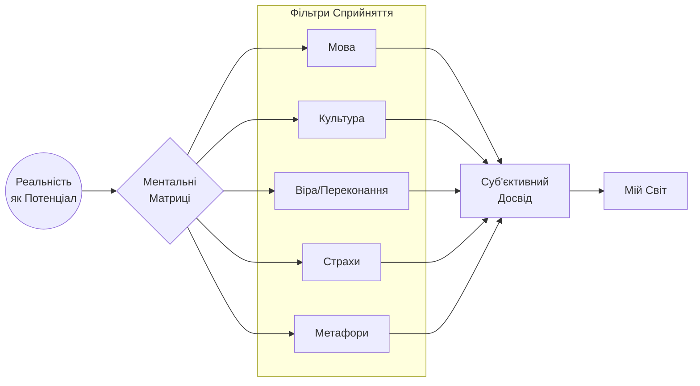
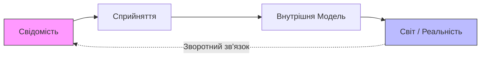

# ФілософіЯ: Суб’єктивний Всесвіт та Ментальні Матриці

Цей документ розкриває світоглядну основу проекту Вільні **Will-n-i**. мИ не просто будуємо програмний код, мИ змінюємо "операційну систему" сприйняття реальності.

## 🌌 Основна Концепція

### I. Тотожність суб’єкта і Всесвіту

> **«Я є Всесвіт. Всесвіт є Я.»**

Це не твердження про фізичну тотожність матерії, а про тотожність досвіду:
*   Всесвіт існує як явище лише через сприйняття.
*   Без суб’єкта немає феномену реальності.
*   Реальність — це подія між свідомістю і буттям.

### II. Існування як умова реальності

Якщо Я як людина існую — то існує Всесвіт. Якщо людина відсутня — немає суб’єкта сприйняття, а отже немає Всесвіту.

Тут Всесвіт трактується не як незалежний об’єкт, а як:
1.  **Структура переживання**
2.  **Сукупність відношень**
3.  **Поле прояву**

мИ не заперечуємо фізичну реальність, але стверджуємо, що без спостерігача вона не має феноменальної форми.

---

## 🧠 Ментальні Матриці

Свідомість працює через матриці (фільтри), які визначають нашу реальність.

Ці матриці:
*   Фільтрують досвід.
*   Формують сенс.
*   Визначають, що стає «реальністю» для конкретної людини.

**Висновк:** Зміна матриці = зміна світу, який тИ проживаєш.

---

## 🏛 Три Стовпи Філософії Willny

### 1. Стоїчна складова
Від стоїцизму мИ беремо:
*   **Внутрішній суверенітет**: Ніхто не має влади над твоїм розумом.
*   **Контроль над інтерпретацією**: Не події вражають нас, а наше ставлення до них.
*   **Відповідальність**: Розділення фактів від суджень.

> *Світ приходить як подія. Реальність формується як ставлення.*

### 2. Растафаріанський елемент
Не як релігійна догма, а як соціальний принцип:
*   Єдність буття (I and I).
*   Життєва цілісність.
*   Природний порядок (Natural Law).
*   **Неприйняття штучних ієрархій ("Вавилону")**: Людина не гвинтик, а частина цілого.

### 3. Соліпсизм як метод відповідальності
Це не твердження "нічого крім мене не існує". Це радикальний інструмент взяття відповідальності:
*   Усе, що Я знаю про світ, проходить через мене.
*   Я відповідаю за свою картину реальності.
*   Я не можу перекласти мислення на систему.
*   Я — точка виникнення сенсу.

---

## ♾ Формула Світотворення

Процес створення реальності можна описати алгоритмічно:

### Узагальнений Маніфест

> «Я є Всесвіт. Всесвіт є Я.
> Растафаріанство, помножене на стоїцизм і пропущене крізь соліпсизм у вигляді ментальних матриць.
>
> Якщо Я як людина існую — існує Всесвіт як досвід.
> Якщо людина відсутня — відсутній суб’єкт сприйняття, а отже немає феноменального Всесвіту.
>
> Світ не даний напряму — він конструюється через свідомість, мову та внутрішні моделі.
> Змінивши матрицю, через яку Я дивлюсь, Я змінюю Всесвіт, у якому живу.»
