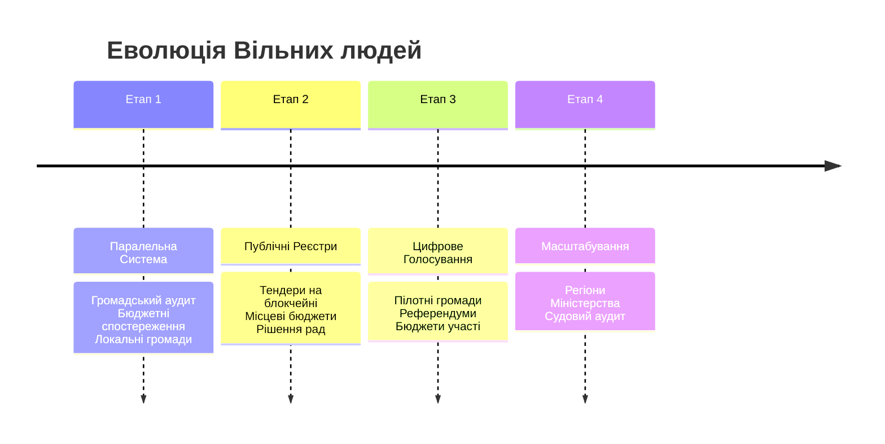

[← На головну](./README.md#content)

# Дорожня Карта та Принципи Реалізації

Опис етапів впровадження системи та механізмів збереження волі.

## 🔄 Етапи Впровадження (Roadmap)

мИ запроваджуємо зміни еволюційно, заміщуючи застарілі інституції ефективними цифровими інструментами.

### Етап 0 — Я є Народ
Фундаментальне усвідомлення кожним учасником: **Я є народ**. Єдиним джерелом влади є народ, і Я здійснюю цю владу безпосередньо.

### Етап 1 — Паралельна система
Створення альтернативи. Інструмент для тих, хто готовий.
- Громадський аудит діяльності влади.
- Аналіз бюджетів.
- Добровільна участь та формування локальних цифрових громад.

### Етап 2 — Публічні реєстри
Переведення офіційних даних у незмінний вигляд (Distributed Ledger).
- Тендери.
- Рішення місцевих рад.
- Діяльність держпідприємств.

### Етап 3 — Пілотні цифрові голосування
Легітимізація прийняття рішень через систему.
- Голосування в громадах (ОСББ, села, міста).
- Локальні референдуми.
- Розподіл "бюджетів участі".

### Етап 4 — Масштабування
Повне виконання функцій кодом.
- Автоматизовані міністерства (смарт-контракти).
- Антикорупційні органи (Ші-аудит).

---

## 🛡 Захист волі

Як гарантувати, що нова система залишиться вільною? Системні інструменти — лише частина відповіді. Справжня свобода гарантована лише тоді, коли кожен здатен проявляти себе як **суб'єкт-народ**, або як **Я-людина**, що перебуває понад державами у статусі Людини.

### Вбудовані механізми (Resilience)
1.  **Я є Народ**: Усвідомлення того, що **Я** і є народ. Єдиним джерелом влади в Україні є народ, і він здійснює свою владу безпосередньо. Це найвища здатність здійснювати свою владу.
2.  **Народні Інституції**: Створення та розвиток альтернатив державним органам, які себе скомпрометували:
    - **Народний контроль**: Прямий нагляд за ресурсами та процесами.
    - **Народний суд**: Справедливість, що чиниться рівними для рівних.
    - **Народне віче**: Пряма демократія в дії.
3.  **Розподілені ноди**: Система живе на багатьох незалежних серверах.
4.  **Відкритий код (Open Source)**: Алгоритми прозорі та доступні для перевірки.
5.  **Право на розгалуження (Fork-право)**: Фундаментальне право громади або людини створити свій варіант розвитку (розгалуження/новий шлях), якщо початковий шлях перестав відповідати їхній волі.
6.  **Ротація валідаторів**: Мережа належить спільноті.
7.  **Громадські DAO-ради**: Колективне управління.

---

## ⚖️ Ключові Принципи

Система базується на наступних критеріях:

*   ✅ **Добровільність**: Участь базується на власному бажанні.
*   ✅ **Права людини**: Пріоритет природних прав.
*   ✅ **Судовий контроль**: Доступ до децентралізованого арбітражу.
*   ✅ **Можливість розгалуження**: Можливість копіювання (форку) та незалежного розвитку іншого шляху.
*   ✅ **Стійкість**: Децентралізація як основа безпеки.

> **Головна ідея:** Люди керують процесами через прозору цифрову інфраструктуру.
