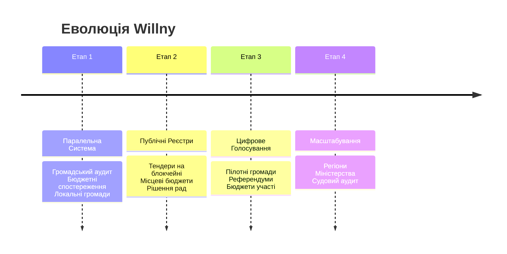

# Дорожня Карта та Принципи Реалізації

Опис етапів впровадження системи та запобіжників від узурпації влади.

## 🔄 Етапи Впровадження (Roadmap)

мИ не намагаємось замінити державу миттєво. Це еволюційний процес заміщення застарілих інституцій ефективними цифровими інструментами.

### Етап 1 — Паралельна система
Не "замість", а "поруч". Інструмент для тих, хто готовий.
- Громадський аудит діяльності влади.
- Аналіз бюджетів.
- Добровільна участь та формування локальних цифрових громад.

### Етап 2 — Публічні реєстри
Переведення офіційних даних у незмінний вигляд (Distributed Ledger).
- Тендери.
- Рішення місцевих рад.
- Діяльність держпідприємств.

### Етап 3 — Пілотні цифрові голосування
Легітимізація прийняття рішень через систему.
- Голосування в громадах (ОСББ, села, міста).
- Локальні референдуми.
- Розподіл "бюджетів участі".

### Етап 4 — Масштабування
Повне заміщення бюрократичних функцій кодом.
- Автоматизовані міністерства (смарт-контракти).
- Антикорупційні органи (AI-аудит).

---

## 🛡 Захист від концентрації влади

Як гарантувати, що нова система не стане цифровою диктатурою?

### Вбудовані механізми (Resilience)
1.  **Розподілені ноди**: Фізична відсутність єдиного сервера, який можна вимкнути.
2.  **Відкритий код (Open Source)**: Кожен може перевірити алгоритми. "Black box" врядування заборонено.
3.  **Ротація валідаторів**: Ніхто не володіє мережею вічно.
4.  **Громадські DAO-ради**: Колективне управління ключовими параметрами.
5.  **Fork-право**: Фундаментальне право громади "відгалузитися", якщо система стала корумпованою, і створити свою версію реальності зі збереженням історії.

---

## ⚖️ Ключові Принципи

Система повинна відповідати наступним критеріям, щоб вважатися легітимною в парадигмі Willny:

*   ✅ **Добровільність**: Жодного примусу до використання.
*   ✅ **Права людини**: Абсолютний пріоритет природних прав.
*   ✅ **Судовий контроль**: Можливість оскарження (децентралізований арбітраж).
*   ✅ **Fork-able**: Можливість створити копію системи і піти своїм шляхом.
*   ⛔ **Стійкість до захоплення**: Неможливість централізації.

> **Головна ідея:** Не "цифровий уряд керує людьми", а люди керують процесами через прозору цифрову інфраструктуру.
