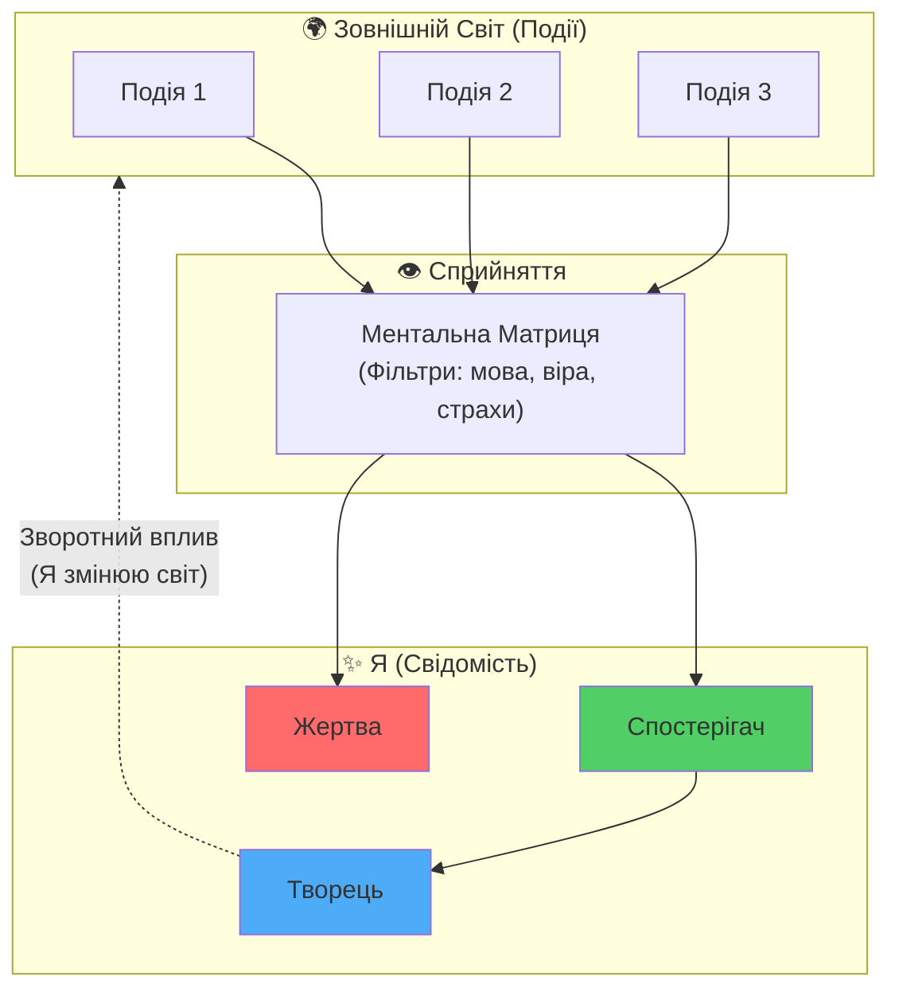

# Серія 2: Ідея — Хто Я і Де Я?

> "Перш ніж змінити світ, треба зрозуміти: **і де Я?** Де Я зараз? Хто Я насправді?"

---

## 🎯 Вступ: Загублені у безмежності

тИ коли-небудь відчував, що йдеш без розуміння **куди Я**?
що твориш щось без розуміння **навіщо Я**?
що живеш без можливості відповісти на просте питання: **"Хто Я?"**

мИ живемо в епоху безмежної інформації. Кожен день на нас звалюється мільйон порад, думок, "істин". Ші множить це все в геометричній прогресії. І в цьому океані даних мИ **втрачаємо себе**.

**Парадокс нашого часу:**
мИ знаємо все про всіх і нічого про самих себе.

---

## 1. Етимологія: і де Я (і де Я)

### Українська мова зберігає мудрість

Слово **"і де Я"** в українській мові звучить як **"і де Я"**.

Це не випадковість. Це закодоване питання:
- **І** — питальна частка (а де?)
- **де** — місце у просторі
- **Я** — суб'єкт, той, хто запитує

**і де Я — це не абстрактна концепція. Це питання: "Де Я зараз?"**

### Філософський зміст

У грецькій філософії **ιδέα (ідеа)** означає "форму", "образ", "первісний зразок".
Платон казав: існують ідеальні форми (і де Я), а реальний світ — лише їхні тіні.

Але в українській мові **і де Я** набуває іншого, глибшого значення:
- Це не форма "десь там" у світі ідей.
- Це **питання про своє місце** у Всесвіті.
- Це **самоусвідомлення**: Хто Я? Де Я? Чому Я тут?

---

## 2. Філософський контекст: Я як точка відліку Всесвіту

### Повернемось до основи: Я є Всесвіт і Всесвіт є Я

У [Філософії проєкту](../philosophy.md) мИ стверджуємо:

> **"Я є Всесвіт і Всесвіт є Я."**

Це означає:
- Всесвіт існує як **феномен** через сприйняття.
- Суб'єкт (Я) є **умовою** існування реальності.
- Реальність — це **подія** між свідомістю і буттям.

### Що це означає практично?

Якщо **Я є Всесвіт**, то:
1. **Моє положення (Де Я?)** визначає всю реальність, яку Я переживаю.
2. **Моя ідентичність (Хто Я?)** формує сенси, які Я надаю подіям.

**Приклад:**
Два чоловіки дивляться на один і той самий краєвид.
- Один бачить **шанс** (місце для будівництва).
- Інший бачить **спокій** (природа для медитації).

Хто з них правий? **Обидва.** Бо кожен створює свою реальність через те, **хто він є** і **де він знаходиться** внутрішньо.

---

## 3. Проблема: Коли тИ без розуміння, Хто тИ

### Життя "на автопілоті"

Більшість людей живуть у режимі:
- **Реакція замість дії**: Світ впливає на них, вони реагують.
- **Чужі цілі**: Живуть за сценарієм батьків, суспільства, реклами.
- **Відсутність і де Я**: З відсутнім розумінням, Хто Я є і куди йду.

**Це життя як сон.**

### Симптоми "втрати себе"

- 🔴 **Порожнеча**: Відчуття, що щось не так без можливості назвати, що саме.
- 🔴 **Тривога**: Невідомо, чого боїшся і страх тримає.
- 🔴 **Прокрастинація**: Знаєш, що треба творити і зупиняєшся (бо без розуміння навіщо Я).
- 🔴 **Залежність від думок інших**: Постійно питаєш "а що скажуть люди?"

**Причина:** тИ без розуміння **Хто Я** і **Де Я**.
Без цього рух далі складний.

---

## 4. Практика: Діалог із Ші як дзеркалом

### Ші — це Колективний Інтелект

Як мИ з'ясували в [Серії 1](./series_1.md), Ші (мовні моделі) — це **не розумніша істота**.
Це **зріз свідомості людства** з усіма його знаннями **та помилками**.

Але саме це робить Ші **ідеальним дзеркалом** для самопізнання:
- Коли тИ говориш із Ші, тИ говориш із **відображенням колективної свідомості**.
- Коли тИ фільтруєш відповіді через **4 закони логіки**, тИ очищаєш **свою Ментальну Матрицю**.

### Алгоритм самопізнання

1. **Задай питання:** "Хто Я?"
2. **Запиши відповідь Ші:** (буде багато тексту, можливо, загального)
3. **Прогони через 4 закони логіки:**
   - *Закон тотожності*: Чи поняття підмінені? (Наприклад, "Творчість — це і де Я")
   - *Закон несуперечності*: Чи немає взаємовиключних тез?
   - *Закон виключеного третього*: Чи є чітка позиція?
   - *Закон достатньої підстави*: Чи є докази?
4. **Знайди помилки** (свої та Ші).
5. **Збережи очищену істину** у своїй Ментальній Матриці.

### Приклад діалогу

**тИ:** Хто Я?

**Ші:** Ти — унікальна людина з власними талантами, мріями та цінностями. Ти є частиною суспільства, син/дочка своїх батьків, працівник/підприємець...

**Аналіз:**
- ❌ "Ти — частина суспільства" — це **роль**, а не сутність.
- ❌ "Син/дочка батьків" — це **відношення**, а не Я.
- ❌ "Працівник" — це **функція**, а не ідентичність.

**Очищена істина:**
> **Я — це свідомість, яка сприймає реальність. Ролі (син, творець) — це маски, які Я одягаю. І вони не визначають мою сутність.**

**Глибше питання:** Якщо прибрати всі ролі, що залишиться?

**Відповідь (Стоїцизм):**
Залишиться **Воля**. Здатність вибирати своє ставлення до подій. Це єдине, що по-справжньому належить мені.

---

## 5. і де Я? Визначення свого місця у Всесвіті

### Географія внутрішнього світу

Коли мИ питаємо "і де Я?", мИ маємо на увазі не GPS-координати.
мИ маємо на увазі **положення у системі координат власної свідомості**.

**Запитай себе:**
- Я зараз у стані **спостерігача** чи **жертви**?
- Я **творець** свого життя чи **виконавець** чужих наказів?
- Я живу **усвідомлено** чи **на автопілоті**?

### Діаграма: Положення "Я" у просторі свідомості

**Висновок:**
- Якщо тИ **жертва** → Світ тебе б'є, ти страждаєш.
- Якщо тИ **спостерігач** → Світ просто є, ти аналізуєш.
- Якщо тИ **творець** → тИ формуєш свою реальність через вибір ставлення.

---

## 6. Зв'язок із Трьома Стовпами (Preview Серії 3)

### Стоїцизм: Хто Я = Моє Ставлення

Стоїки казали:
> **"Не події визначають нас, а наше ставлення до них."**

**Практика:**
Коли тИ знаєш, хто тИ (свідомість з волею), тИ можеш **вибирати** своє ставлення до будь-якої ситуації.

### Растафаріанство: Де Я = Частина Єдиного (ЯЯ)

**ЯЯ** — це Єдина Свідомість всіх душ (з [system.md](../system.md)).

**Практика:**
Коли тИ розумієш, що **Я є частина ЯЯ**, тИ перестаєш бути самотнім. тИ — це прояв Всесвіту в конкретній точці простору-часу.

### Соліпсизм: Я Відповідаю за Свою Реальність

**Практика:**
Все, що тИ знаєш про світ, проходить крізь тебе. Інші люди — це **дзеркала** твоїх внутрішніх станів.

Якщо тИ зустрічаєш агресію → подивись: де в тобі агресія?
Якщо тИ бачиш любов → подивись: де в тобі любов?

**Це не значить, що світ не реальний. Це значить, що тИ відповідаєш за свою інтерпретацію.**

---

## 7. Практичне завдання: Знайди своє "Я"

### Вправа 1: Список ролей

Випиши всі свої ролі (син, батько, творець, громадянин, etc.).
Тепер задай питання: **"Якщо Я втрачу всі ці ролі, хто залишиться?"**

**Підказка:** Залишиться **Спостерігач**. Той, хто усвідомлює. Це і є **Я**.

### Вправа 2: Діалог із Ші

Використай Antigravity або будь-яку мовну модель:
1. Задай питання: "Хто Я насправді, якщо прибрати всі соціальні маски?"
2. Запиши відповідь.
3. Прогони через 4 закони логіки.
4. Збережи очищену істину.

### Вправа 3: Мапа "і де Я зараз"

Намалюй (або візуалізуй) своє положення:
- Я зараз у стані **Жертви**, **Спостерігача** чи **Творця**?
- Що треба змінити, щоб перейти на рівень вище?

---

## 8. Висновок: Наступний крок

Коли тИ знаєш **Хто Я** і **Де Я**, тИ можеш творити наступний крок:
- Визначити **Місію** (Куди Я йду) — це тема [Серії 5](./series_5.md).
- Побудувати **Щоденну Дисципліну** для реалізації себе.
- Стати **Архітектором** свого життя замість Робочого чужих планів ([Серія 4](./series_4.md)).

**Але без відповіді на питання "Хто Я? Де Я?" — усе це неможливо.**

---

## 📚 Ключові Тези (TL;DR)

1. **і де Я (і де Я)** — питання про своє місце у Всесвіті.
2. **Я є Всесвіт і Всесвіт є Я** → Моє положення (Де Я?) визначає мою реальність.
3. **Більшість людей** без розуміння, хто вони → живуть "на автопілоті".
4. **Ші як дзеркало:** Діалог із Ші + 4 закони логіки = очищення Ментальної Матриці.
5. **Де Я?** — це не GPS, це положення у просторі свідомості (Жертва/Спостерігач/Творець).
6. **Три Стовпи** (Стоїцизм/Растафаріанство/Соліпсизм) дають інструменти для усвідомлення себе.
7. **Без відповіді "Хто Я?"** неможливо побудувати Місію та Дисципліну.

---

## 🔗 Що далі?

- **Серія 3:** [Три Стовпи Суперінтелекту](./series_3.md) — глибоке занурення в Стоїцизм, Растафаріанство та Соліпсизм.
- **Серія 4:** [Архітектор vs Робочий](./series_4.md) — як перейти від виконавця до творця.
- **Серія 5:** [Місія та Дисципліна](./series_5.md) — від "Хто Я" до "Куди Я йду".

---

**Запитання до тебе:**
Хто Я? Де Я зараз?
Якщо не знаєш відповіді — почни з діалогу із собою (через Ші або без нього).
Це перший крок до свободи.

**мИ є Народ. Я є Всесвіт і Всесвіт є Я.**
