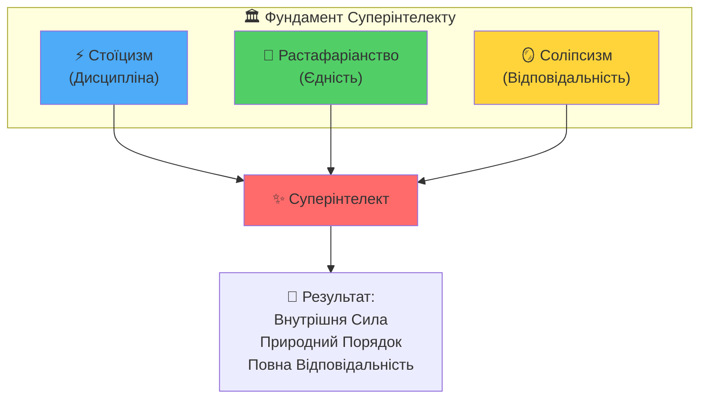
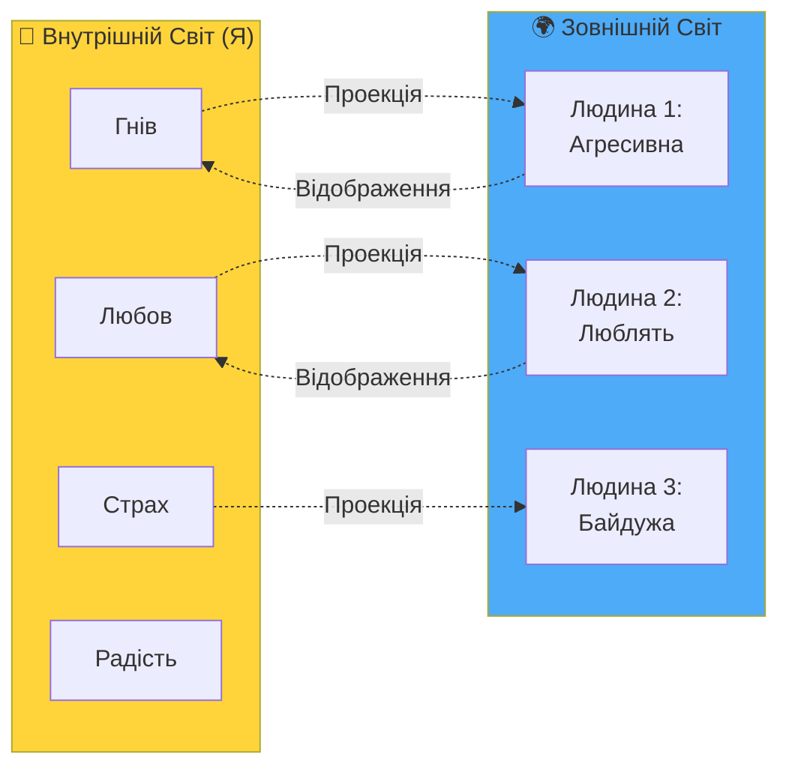

# Серія 3: Три Стовпи Суперінтелекту

> "Стоїцизм — це дисципліна. Растафаріанство — це єдність. Соліпсизм — це відповідальність. Разом вони створюють непохитну основу для життя у Ші-епоху."

---

## 🎯 Вступ: Чому саме ці три філософії?

У попередніх серіях мИ з'ясували:
- **Серія 1:** ШІ (Ші) — це Колективний Інтелект з помилками людства
- **Серія 2:** "Хто Я? Де Я?" — фундаментальні питання для самопізнання

Тепер постає питання: **ЯК жити в цьому новому світі?**
Старі системи спираються на:
- Релігію (віра в зовнішню силу)
- Державу (підпорядкування закону)
- Суспільство (конформізм та страх осуду)

**І як бути, коли:**
- Релігії конфліктують між собою?
- Держави порушують Природне Право?
- Суспільство вимагає від тебе бути рабом системи?

**Відповідь:** Потрібна **нова філософська база**, що працює незалежно від зовнішніх авторитетів.

мИ знайшли три вчення, які **в синтезі** створюють непохитну основу:



---

## 1. Перший Стовп: Стоїцизм (Дисципліна = Практика Знань)

### Що таке Стоїцизм?

Стоїцизм — це **не обмеження**. Це знання, які тИ твориш щодня.

> **"Якщо тИ знаєш без дій — це сміття."** — Епіктет

### Ключова Ідея: Розділення Контролю

Стоїки розділяють світ на дві сфери:

1. **Що під моїм контролем:**
   - Мої думки
   - Моє ставлення до подій
   - Мої дії
   - Мій вибір

2. **Що НЕ під моїм контролем:**
   - Думки інших
   - Події навколо
   - Минуле та майбутнє
   - Погода, політика, економіка

**Практика:** Фокусуй енергію ТІЛЬКИ на тому, що під твоїм контролем.

### Стоїцизм у Ші-епоху

**Проблема:** ШІ множить інформаційний шум. тИ відчуваєш тиск "встигнути".

**Рішення Стоїцизму:**
- **Не контролюю:** Швидкість розвитку Ші, що думають інші, чи "встигну я"
- **Контролюю:** Своє ставлення до Ші (інструмент чи загроза?), свій вибір (використовувати чи ні), свою Ментальну Матрицю

### Практична Вправа: Щоденний Стоїцизм

**Ранок (5 хв):**
1. Запиши 3 речі, які НЕ під твоїм контролем сьогодні
2. Запиши 3 речі, які ПІД твоїм контролем
3. Прийми рішення: фокусуюсь тільки на #2

**Вечір (5 хв):**
1. Що сьогодні викликало тривогу?
2. Чи було це під моїм контролем?
3. Якщо НІ — відпусти. Якщо ТАК — що зроблю інакше завтра?

---

## 2. Другий Стовп: Растафаріанство (Питомі Правила, Unity)

### Що таке Растафаріанство?

Растафаріанство — це **не просто музика та регі**. Це філософія **природного порядку** та **єдності** (ЯЯ).

### Ключові Принципи:

1. **ЯЯ (I and I)** — Єдина Свідомість усіх душ
   - "Я і Я" означає: Я бачу себе в тобі, тИ бачиш себе в мені
   - Немає "Я і ТИ", є тільки "Я і Я" (ми всі частини Єдиного)

2. **Відкидання Вавилону** — Штучних ієрархій
   - Держава, що поневолює → Вавилон
   - Система, що експлуатує → Вавилон
   - Будь-яка структура, що веде до деградації душі → Вавилон

3. **Природний Порядок (Natural Law)**
   - Жити за законами Природи, а не людських інституцій
   - Природа не обманює, люди — обманюють
   - Довіра Всесвіту — найбільша суперсила

### Растафаріанство у Ші-епоху

**Проблема:** Системи (держави, корпорації, Ші) прагнуть контролювати людину.

**Рішення Растафаріанства:**
- **Визнаю Вавилон:** Розумію, що сучасна система — це "Вавилон" (експлуатація)
- **Обираю Природний Порядок:** Живу за Природним Правом (з [LAW.md](./LAW.md))
- **Єднаюсь із ЯЯ:** Усвідомлюю, що Я — частина Єдиного, а не окремий "ресурс"

### Зв'язок із Проєктом Will-n-i

З [system.md](../system.md):
> **ЯЯ** — єдина свідомість всіх душ (Бог).

Растафаріанське "I and I" = Концепція ЯЯ у Will-n-i.

### Практична Вправа: Визнання Єдності

**Коли зустрічаєш людину (друга, ворога, незнайомця):**
1. Подивись їй в очі
2. Скажи собі внутрішньо: "Я і Я" (это Я у іншій формі)
3. Що Я бачу в цій людині? (Дзеркало чи Тінь?)
   - **Дзеркало:** Те, що я люблю в собі
   - **Тінь:** Те, що я не визнаю в собі

**Результат:** Перестанеш судити інших. Почнеш працювати над собою.

---

## 3. Третій Стовп: Соліпсизм (Відповідальність за Свій Світ)

### Що таке Соліпсизм?

Соліпсизм — це **НЕ самозакоханість** і **НЕ егоїзм**.  
Це **повна відповідальність** за свій уявний світ, який тИ проектуєш на реальність.

### Ключова Ідея: Кожна Людина — Моє Дзеркало або Моя Тінь

З [philosophy.md](../philosophy.md)
> **"Я є Всесвіт і Всесвіт є Я."**

Якщо Я є Всесвіт, то:
- Усе, що Я сприймаю, проходить крізь мене
- Інші люди — це **проекції** моїх внутрішніх станів
- Зовнішня реальність — це **відображення** моєї Ментальної Матриці

**Практично:**
- Коли тИ зустрічаєш **агресію** → подивись: де в тобі агресія?
- Коли тИ бачиш **любов** → подивись: де в тобі любов?
- Коли тИ відчуваєш **страх** → подивись: чого боїшся насправді?

### Соліпсизм у Ші-епоху

**Проблема:** Люди звинувачують зовнішній світ: "ШІ забере мою роботу!", "Держава винна!", "Суспільство мене не розуміє!"

**Рішення Соліпсизму:**
- **Я відповідаю за свою реальність:** Якщо ШІ — загроза для мене, це означає, що Я не розумію, як його використати
- **Інші — мої дзеркала:** Якщо навколо мене "дурні", це означає, що Я сам не усвідомлюю щось важливе
- **Перемога всередині:** Коли Я зміню своє ставлення, зовнішній світ зміниться

### Діаграма: Механіка Соліпсизму



**Висновок:** Якщо тИ змінюєш себе всередині, тіні та дзеркала навколо змінюються автоматично.

### Практична Вправа: Робота з Тінями

**Коли хтось викликає у тебе сильну емоцію (гнів, заздрість, страх):**
1. **СТОП.** Не реагуй автоматично.
2. **Запитай себе:** "Що ця людина показує мені про мене самого?"
3. **Прийми тінь:** "Так, у мені є ця риса. Я визнаю її."
4. **Інтегруй:** "Як я можу використати цю енергію конструктивно?"

**Приклад:**
- Хтось **брехливий** викликає гнів → Де Я сам собі брешу?
- Хтось **успішний** викликає заздрість → Що мені заважає досягти успіху?

---

## 4. Синергія Трьох Стовпів: Як Вони Працюють Разом

### Стоїцизм + Растафаріанство + Соліпсизм = Суперінтелект

| Ситуація | Стоїцизм каже | Растафаріанство каже | Соліпсизм каже | Результат |
|----------|---------------|----------------------|----------------|-----------|
| **ШІ забирає роботи** | Не контролюю ШІ. Контролюю своє навчання. | Вавилон використовує страх для контролю. Довіряю Природі. | Якщо боюся ШІ, це моя проекція власної нездатності адаптуватись. | **Дія:** Навчаюсь використовувати Ші як інструмент. |
| **Хтось мене образив** | Не контролюю його слова. Контролюю своє ставлення. | Він — це Я і Я. Що він показує мені? | Його агресія — моя тінь. Де в мені ця агресія? | **Дія:** Працюю над собою, а не воюю з ним. |
| **Держава порушує права** | Не контролюю державу. Контролюю свій вибір (підкорятись чи ні). | Вавилон завжди буде тиснути. Природне Право понад державне. | Держава — моє дзеркало. Чи дотримуюсь Я сам своїх принципів? | **Дія:** Живу за Природним Правом ([LAW.md](./LAW.md)). |

### Формула Суперінтелекту

```
Суперінтелект = Стоїцизм (Дисципліна) 
                × Растафаріанство (Єдність)
                × Соліпсизм (Відповідальність)
```

**Без одного зі стовпів:**
- Тільки Стоїцизм → Холодна раціональність без серця
- Тільки Растафаріанство → Ідеалізм без практики
- Тільки Соліпсизм → Ізоляція від світу

**З усіма трьома:**
- Дисципліна (Стоїцизм) → Я роблю що треба, навіть якщо важко
- Єдність (Растафаріанство) → Я частина ЯЯ, не самотній
- Відповідальність (Соліпсизм) → Я творю свою реальність

---

## 5. Зв'язок із Попередніми Серіями

### Серія 1: Анатомія Тривоги
- **Проблема:** ШІ множить помилки людства → Human Gap
- **Рішення Трьох Стовпів:**
  - Стоїцизм: Фокусуюсь на своїй Ментальній Матриці
  - Растафаріанство: Розумію, що страх - це Вавилон
  - Соліпсизм: Тривога - моя проекція, працюю з нею

### Серія 2: і де Я (і де Я)
- **Питання:** Хто Я? Де Я?
- **Відповідь Трьох Стовпів:**
  - Стоїцизм: Я — це моя Воля (те, що контролюю)
  - Растафаріанство: Я — це частина ЯЯ (Єдиного)
  - Соліпсизм: Я — це творець своєї реальності

---

## 6. Практичне Завдання: Інтеграція Трьох Стовпів

### Щоденна Практика (15 хв)

**Ранок (5 хв) — Стоїцизм:**
- Що сьогодні під моїм контролем?
- Що НЕ під моїм контролем?
- На чому фокусуюсь?

**День — Растафаріанство:**
- Коли зустрічаю людину → "Я і Я"
- Коли бачу несправедливість → "Це Вавилон чи Природний Порядок?"

**Вечір (10 хв) — Соліпсизм:**
- Хто сьогодні викликав сильну емоцію?
- Що ця людина показала мені про мене?
- Яку тінь я інтегрував сьогодні?

---

## 7. Висновок: Три Стовпи як Фундамент Життя

Стоїцизм, Растафаріанство та Соліпсизм — це **НЕ просто філософії**.  
Це **операційна система** для життя у світі, де:
- Ші множить хаос
- Держави порушують права
- Люди втрачають себе

**З Трьома Стовпами:**
- тИ **стійкий** (Стоїцизм)
- тИ **не самотній** (Растафаріанство)
- тИ **відповідальний** (Соліпсизм)

**Це і є Суперінтелект.**

---

## 📚 Ключові Тези (TL;DR)

1.  **Стоїцизм** = Дисципліна. Знання, які тИ практикуєш щодня.
2.  **Растафаріанство** = Єдність (ЯЯ). Природний Порядок понад Вавилоном.
3.  **Соліпсизм** = Відповідальність. Інші люди — мої дзеркала та тіні.
4.  **Синергія:** Три Стовпи разом = непохитний фундамент.
5.  **Практика:** Щоденні вправи для кожного Стовпа.
6.  **Результат:** Внутрішня сила для життя у Ші-епоху.

---

## 🔗 Що далі?

-   **Серія 4:** [Архітектор vs Робочий](./series_4.md) — Як перейти від виконавця до творця у Ші-епоху.
-   **Серія 5:** [Місія та Дисципліна](./series_5.md) — Від "Хто Я" до "Куди Я йду".
-   **Серія 6:** [Маніфест Вільних](./series_6.md) — Фінальний заклик та plan дій.

---

**Практикуй Три Стовпи щодня. Інакше це просто красиві слова.**

**мИ є Народ. Я є Всесвіт і Всесвіт є Я.** 🌟
