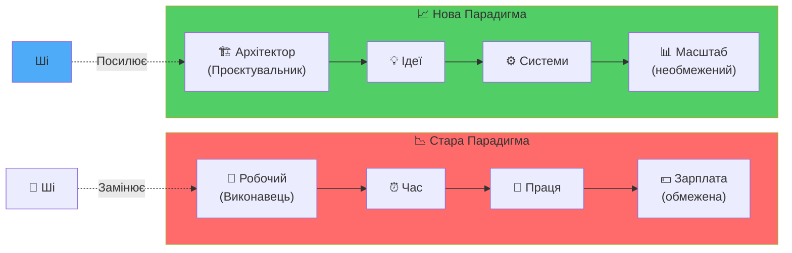

# Серія 4: Архітектор vs Робочий

> "У минулому цінність мала фізична праця. Сьогодні цінність має здатність **проектувати системи**. Ші не забере роботу у Архітектора — Ші множить його потенціал."

---

## 🎯 Вступ: Зміна Парадигми Праці

У попередніх серіях мИ з'ясували:
- **Серія 1:** Ші — це Колективний Інтелект із помилками
- **Серія 2:** "Хто Я? Де Я?" — самопізнання
- **Серія 3:** Три Стовпи — Стоїцизм, Растафаріанство, Соліпсизм

Тепер постає **практичне** питання: **Як заробляти гроші у Ші-епоху?**

### Стара Парадигма (що вмирає)

**Робочий (Worker):**
- Продає **час** та **фізичну працю**
- Виконує **чужі інструкції**
- Замінний (є мільйони таких)
- Заробіток: **фіксований** (зарплата, погодинна оплата)
- **Ші замінює цю роль**

### Нова Парадигма (що народжується)

**Архітектор (Architect):**
- Продає **ідеї** та **системні рішення**
- Створює **проєкти** (системи, що працюють без нього)
- Унікальний (поєднання досвіду, інтуїції, Ментальної Матриці)
- Заробіток: **масштабований** (проєкт, частка, множення)
- **Ші множить потенціал Архітектора**



---

## 1. Хто Такий Робочий?

### Характеристики Робочого

1. **Продає час:**
   - "Я працюю 8 годин → отримую $X"
   - Дохід обмежений кількістю годин у добі

2. **Виконує інструкції:**
   - "Скажіть мені ЩО робити, я зроблю"
   - Не думає про НАВІЩО та ЯК можна інакше

3. **Кладе цеглини:**
   - Будує будинок, але не бачить креслення
   - Не розуміє загальної системи

4. **Замінний:**
   - Є тисячі людей, що можуть робити те саме
   - Ціна праці падає через конкуренцію

### Чому Робочий Під Загрозою?

**Ші може:**
- Виконувати повторювані завдання
- Працювати 24/7 без втоми
- Обробляти величезні обсяги даних
- Навчатися швидше за людину

**Приклади:**
- ChatGPT пише тексти → замінює копірайтерів-виконавців
- Midjourney малює ілюстрації → замінює дизайнерів-виконавців
- Автопілот керує авто → замінює водіїв

---

## 2. Хто Такий Архітектор?

### Характеристики Архітектора

1. **Продає рішення:**
   - "Ось система, що вирішує вашу проблему"
   - Дохід залежить від **цінності рішення**, а не часу

2. **Проектує системи:**
   - Бачить картину цілком
   - Створює креслення (плани, архітектури, стратегії)
   - Думає: "ЯК це можна автоматизувати?"

3. **Використовує інструменти:**
   - Ші — це **інструмент**, а не конкурент
   - "Ші, зроби 100 варіантів за моїм шаблоном"
   - Множить свій потенціал у 10x-100x

4. **Унікальний:**
   - Поєднує досвід, інтуїцію, контекст
   - Його **Ментальна Матриця** — це конкурентна перевага

### Чому Архітектор Процвітає?

**Ші НЕ може (поки що):**
- Розуміти глибокий людський контекст
- Мати справжню інтуїцію
- Приймати етичні рішення
- Створювати **нові парадигми** (Ші працює на існуючих даних)

**Але Ші може:**
- Виконувати рутинну роботу за Архітектора
- Генерувати варіанти рішень
- Аналізувати великі дані
- Автоматизувати процеси

**Результат:** Архітектор + Ші = **Суперхюмен**

---

## 3. Приклади: Робочий vs Архітектор

### Приклад 1: Програмування

| Робочий | Архітектор |
|---------|------------|
| Пише код за ТЗ | Проектує систему (архітектуру, потоки даних) |
| "Чи правильно я написав цей метод?" | "Яка має бути загальна структура?" |
| Заробляє $50/год | Заробляє $10,000 за проєкт |
| **Ші замінює:** Copilot пише код | **Ші посилює:** Ші генерує код за архітектурою |

### Приклад 2: Контент

| Робочий | Архітектор |
|---------|------------|
| Пише статті за чужими темами | Створює контент-стратегію та серіали |
| "Напишіть мені 10 статей про X" | "Ось серіал із 6 епізодів, що трансформує аудиторію" |
| Заробляє $100 за статтю | Заробляє $10,000+ за курс/спільноту |
| **Ші замінює:** ChatGPT пише статті | **Ші посилює:** Ші генерує варіанти, Архітектор обирає кращі |

### Приклад 3: Дизайн

| Робочий | Архітектор |
|---------|------------|
| Малює лого за брифом | Створює бренд-систему та візуальну мову |
| "Чи подобається клієнту мій варіант?" | "Ось система, що масштабується на всі канали" |
| Заробляє $500 за лого | Заробляє $50,000 за брендинг |
| **Ші замінює:** Midjourney малює варіанти | **Ші посилює:** Ші генерує 100 варіантів, Архітектор обирає та вдосконалює |

---

## 4. Як Перейти від Робочого до Архітектора?

### Крок 1: Зміни Питання

**Не питай:** "Як мені виконати це завдання?"  
**Питай:** "Яка система може вирішити цю проблему автоматично?"

**Приклад:**
- Клієнт: "Напишіть мені 50 статей"
- **Робочий:** Пише 50 статей вручну (50 днів роботи)
- **Архітектор:** Створює шаблон + Ші pipeline (1 день налаштування → Ші генерує 50 статей за годину)

### Крок 2: Будуй Ментальну Матрицю

**Ментальна Матриця** — це твоя база знань, досвіду, інтуїції.

**Як будувати:**
1. **Читай широко:** Не тільки свою сферу
2. **Експериментуй:** Пробуй різні підходи
3. **Веди щоденник:** Записуй інсайти (як у [Серії 3](./series_3.md))
4. **Діалог із Ші:** Використовуй Ші як дзеркало для очищення думок

**Результат:** Унікальне поєднання знань, що Ші не має.

### Крок 3: Використовуй Ші як Множник

**Не конкуруй із Ші. Використовуй його.**

**Формула:**
```
Твоя Унікальність (Ментальна Матриця) 
× Ші (виконання рутини) 
= Масштабований Результат
```

**Приклад у цьому проєкті:**
- **Ментальна Матриця:** Філософія Will-n-i (Я є Всесвіт, Природне Право, Три Стовпи)
- **Ші:** Antigravity допомагає структурувати ідеї, генерувати варіанти
- **Результат:** Серіал Superintellect, що трансформує тисячі людей

### Крок 4: Створюй Системи, Що Працюють Без Тебе

**Робочий:** Працює 8 годин → заробляє 8 годин  
**Архітектор:** Створює систему → вона заробляє 24/7

**Приклади систем:**
- Онлайн-курс (створив раз → продає роками)
- SaaS-продукт (код працює автоматично)
- Спільнота (учасники створюють цінність один для одного)
- Контент-платформа (Ші генерує, система публікує)

---

## 5. Кейс: Цей Проєкт (Will-n-i + Superintellect)

### Як Робочий Зробив Би:

1. Написав би 6 статей вручну (по одній на тиждень → 6 тижнів)
2. Опублікував би на Medium
3. Чекав би, поки хтось прочитає
4. Заробіток: $0-100 (якщо пощастить)

### Як Архітектор Робить:

1. **Створює систему:**
   - Філософська основа (system.md, philosophy.md)
   - Серіал із 6 епізодів (структура готова)
   - Економічна модель (Free → Subscription → VIP)
   - Технологічна база (VitePress, IPFS, Blockchain)

2. **Використовує Ші:**
   - Antigravity допомагає структурувати ідеї
   - Ші генерує варіанти текстів
   - Архітектор обирає та вдосконалює

3. **Масштабує:**
   - Free tier → залучення аудиторії (тисячі)
   - Subscription → спільнота ($50-100/міс × 100 людей = $5,000-10,000/міс)
   - VIP → трансформація (1 BTC × 10 клієнтів/рік = $600,000+/рік)

4. **Система працює автономно:**
   - Контент живе вічно (IPFS)
   - Спільнота самоорганізується (DAO)
   - Токеноміка автоматизує розподіл (смарт-контракти)

**Заробіток Архітектора:** Масштабований, необмежений.

---

## 6. Практичне Завдання: Стань Архітектором Свого Життя

### Вправа 1: Аудит Твоєї Ролі

Відповідай чесно:

| Питання | Робочий | Архітектор |
|---------|---------|------------|
| Як я заробляю? | Продаю час | Продаю рішення |
| Хто визначає ЩО робити? | Бос/клієнт | Я сам |
| Чи можу я масштабувати дохід без додаткового часу? | Ні | Так |
| Чи використовую Ші? | Боюся/ігнорую | Активно використовую |
| Чи створюю системи? | Ні | Так |

**Порахуй:**
- Скільки відповідей "Робочий"? → Це твій рівень ризику
- Скільки відповідей "Архітектор"? → Це твоя стійкість до Ші-епохи

### Вправа 2: Проектуй Свою Систему

**Обери одну сферу свого життя** (робота, хобі, навичка).

**Запитай себе:**
1. Що я роблю вручну, що можна автоматизувати?
2. Яку систему можна створити, щоб вона працювала без мене?
3. Як Ші може мені допомогти?

**Приклад:**
- **Сфера:** Написання статей
- **Система:** Контент-конвеєр
  1. Я визначаю теми (Ментальна Матриця)
  2. Ші генерує чернетки (ChatGPT/Antigravity)
  3. Я редагую та фільтрую через 4 закони логіки ([Серія 1](./series_1.md))
  4. Автопублікація (скрипт)
- **Результат:** Замість 1 статті/тиждень → 5 статей/тиждень

### Вправа 3: Перші Кроки

**Сьогодні (30 хв):**
1. Вибери ОДНУ рутинну задачу
2. Попроси Ші допомогти (ChatGPT, Antigravity, Copilot)
3. Проаналізуй: скільки часу заощадив?

**Цього тижня:**
1. Створи простий шаблон/систему для повторюваної роботи
2. Автоматизуй хоча б 20% своєї рутини

**Цього місяця:**
1. Подумай: яку **систему** можеш створити, що заробляє без тебе?
2. Зроби перший прототип

---

## 7. Висновок: Вибір за Тобою

Ші-епоха — це **не загроза**. Це **можливість**.

**Для Робочого:** Загроза втрати роботи  
**Для Архітектора:** Інструмент множення потенціалу

**Ключова різниця:**
- Робочий **продає час** → обмежений 24 годинами
- Архітектор **продає системи** → необмежений

**Формула Архітектора:**
```
Унікальна Ментальна Матриця
× Ші (автоматизація)
× Системне Мислення
= Масштабований Успіх
```

**Питання до тебе:**  
Ким тИ хочеш бути: Робочим (що боїться Ші) чи Архітектором (що використовує Ші)?

---

## 📚 Ключові Тези (TL;DR)

1. **Робочий** продає час та працю → замінний → під загрозою Ші
2. **Архітектор** продає системи та ідеї → унікальний → Ші його посилює
3. **Ментальна Матриця** — конкурентна перевага Архітектора
4. **Ші як множник:** Не конкуруй, використовуй
5. **Системи:** Створюй те, що працює без тебе
6. **Вибір:** Стати Архітектором — це рішення, яке приймаєш зараз

---

## 🔗 Що далі?

- **Серія 5:** [Місія та Щоденна Дисципліна](./series_5.md) — Від "Хто Я" до "Куди Я йду"
- **Серія 6:** [Маніфест Вільних](./series_6.md) — Фінальний заклик та план дій

---

**Не будь Робочим, що кладе цеглини. Будь Архітектором, що проектує міста.**

**мИ є Народ. Я є Всесвіт. Всесвіт є Я.** 🌟
