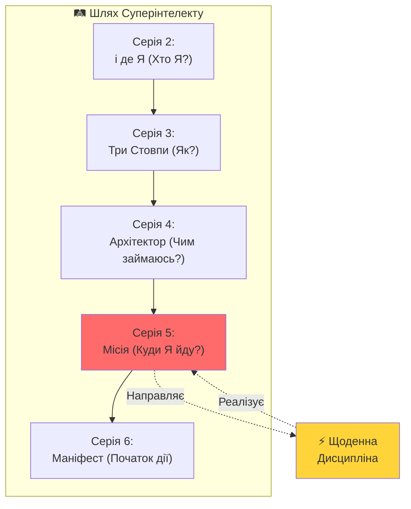
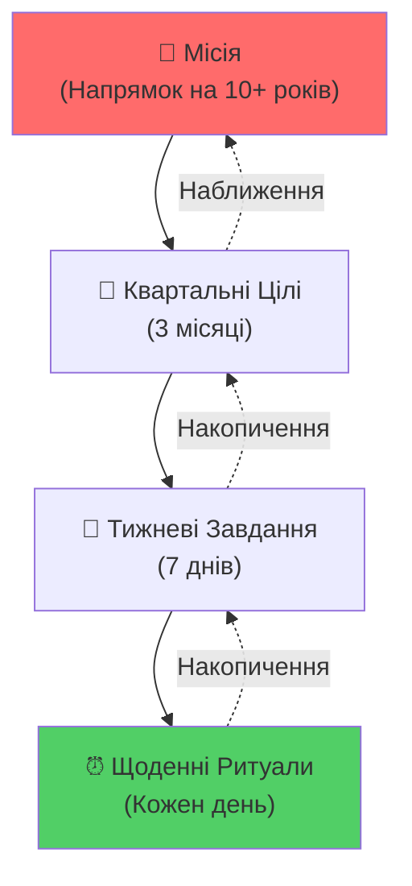

# Серія 5: Місія та Щоденна Дисципліна

> "Коли тИ знаєш **Хто Я** (Серія 2) та **Як Я дію** (Серії 3-4), залишається головне питання: **Куди Я йду?** Місія — це компас. Дисципліна — це крок."

---

## 🎯 Вступ: Від і де Я до Місії

У попередніх серіях мИ пройшли шлях:
- **Серія 1:** Зрозуміли Human Gap та роль Ші
- **Серія 2:** Відповіли на "Хто Я? Де Я?" (і де Я = і де Я)
- **Серія 3:** Побудували фундамент (Три Стовпи)
- **Серія 4:** Навчились мислити як Архітектор

Тепер **критичне питання:**
**Куди Я йду? Навіщо Я існую? Яка моя Місія?**

Без відповіді на це питання:
- тИ будеш блукати (навіть із супер-інструментами)
- тИ втратиш мотивацію (коли буде важко)
- тИ не зможеш відрізнити важливе від термінового

**З Місією:**
- Кожен день має сенс
- Рішення приймаються легко (чи веде це до Місії?)
- Дисципліна стає природною (бо знаєш НАВІЩО)



---

## 1. Що Таке Місія?

### Місія ≠ Мета

**Мета** — це точка призначення:
- "Заробити $1,000,000"
- "Купити будинок"
- "Схуднути на 10 кг"

**Місія** — це напрямок руху:
- "Створювати інструменти для звільнення людей від Вавилону"
- "Ділитися мудрістю через мистецтво"
- "Будувати спільноти, де кожен є суб'єктом"

**Різниця:**
- Мету можна досягти (і тоді що?)
- Місію можна тільки **жити** (вона не закінчується)

### Місія як Компас

**Компас не показує шлях. Він показує напрямок.**

Місія не каже тобі:
- ❌ "Зроби А, потім Б, потім В"
- ❌ "Ось єдиний правильний шлях"

Місія каже тобі:
- ✅ "Рухайся в цей бік (Північ)"
- ✅ "Якщо вибір — питай: чи наближає це до Місії?"

### Приклади Місій

**Особисті:**
- "Стати мудрішим щодня через практику Трьох Стовпів"
- "Творити красу, що надихає інших"
- "Вирости як Архітектор систем, що змінюють світ"

**Глобальні (як у Will-n-i):**
- "Побудувати цифрову інфраструктуру для суверенних громадян"
- "Звільнити людство від Вавилону через Природне Право"
- "Створити екосистему, де Ші служить людині, а не навпаки"

---

## 2. Як Знайти Свою Місію?

### Метод 1: Діалог із Собою (через Ші)

**Крок 1:** Задай собі (або Ші) глибокі питання:

1. **Що мене по-справжньому хвилює?**
   (Не що "треба", а що **палить душу**)

2. **Якби в мене було необмежено ресурсів, чим би я займався?**
   (Гроші, час, можливості — безмежні)

3. **Що я хочу залишити після себе?**
   (Коли мене не буде, що буде продовжувати існувати?)

4. **Які проблеми я бачу у світі, що МЕНЕ болять?**
   (Не абстрактні, а ті, від яких справді страждаєш)

**Крок 2:** Запиши відповіді

**Крок 3:** Прогони через 4 закони логіки ([Серія 1](./series_1.md))
- Відкинь "треба" (соціальний тиск)
- Відкинь суперечності
- Залиш тільки те, що **істинно резонує**

**Крок 4:** Сформулюй у 1-2 реченнях

**Приклад діалогу:**
- **тИ:** Що мене по-справжньому хвилює?
- **Ші:** (генерує 10 варіантів)
- **тИ:** (фільтруєш через логіку та інтуїцію)
- **Результат:** "Мене хвилює, що люди живуть як раби системи, не усвідомлюючи своєї внутрішньої сили"

**Місія:** "Допомагати людям знайти внутрішню силу через філософію та практику"

### Метод 2: Аналіз Болю

**Місія часто народжується з болю.**

**Питання:**
1. Що мене найбільше **бісить** у світі?
2. Чого мені **не вистачало** в минулому?
3. Яку **несправедливість** я бачу постійно?

**Приклад (Will-n-i):**
- **Біль:** Держави порушують природні права людей
- **Не вистачало:** Інструменту для прямої демократії без корупції
- **Несправедливість:** Система перетворює людей на "ресурс"

**Місія:** "Побудувати децентралізовану систему, де кожна людина — суб'єкт, а не об'єкт"

### Метод 3: Зворотня Інженерія від Ідеалу

**Уяви:**
Минуло 10 років. тИ досяг свого ідеального стану.

**Питання:**
1. Хто Я в цьому майбутньому? (Яка роль?)
2. Що тИ робиш щодня?
3. Який вплив тИ маєш на світ?
4. Що люди кажуть про тебе?

**Тепер подивись назад:**
Який **шлях** вів до цього? Це і є твоя Місія.

---

## 3. Від Місії до Щоденної Дисципліни

### Проблема: Місія без Дії = Фантазія

Багато людей мають "красиву місію", але:
- Не роблять нічого для неї
- Відкладають "на потім"
- Чекають "ідеальних умов"

**Стоїцизм каже ([Серія 3](./series_3.md)):**
> **"Якщо тИ знаєш без дій — це сміття."**

**Рішення:** Перетвори Місію на **Щоденні Дії**.

### Формула: Місія → Квартальні Цілі → Тижневі Завдання → Щоденні Ритуали



**Приклад (Will-n-i):**

| Рівень | Формулювання |
|--------|--------------|
| **Місія** | Побудувати децентралізовану систему для суверенних громадян |
| **Квартал Q1 2026** | Завершити серіал Superintellect (6 серій), залучити 1000 читачів |
| **Цей тиждень** | Написати Серії 3-6, налаштувати навігацію VitePress |
| **Сьогодні** | Написати Серію 5 (ця стаття) |

---

## 4. Щоденна Дисципліна: Ритуали Суперінтелекту

### Чому Ритуали, а не "Завдання"?

**Завдання:**
- Залежать від мотивації
- "Сьогодні не хочу → не роблю"
- Вимагають силу волі

**Ритуали:**
- Автоматичні (як чистити зуби)
- Відбуваються незалежно від настрою
- Стають частиною ідентичності ("Я той, хто робить це щодня")

### Мінімальний Набір Ритуалів (30 хв/день)

#### Ранок (10 хв) — Стоїцизм

**Мета:** Налаштувати фокус на день

1. **Pregame (2 хв):**
   Запитай себе:
   - Що сьогодні під моїм контролем?
   - Що НЕ під моїм контролем?
   - На чому фокусуюсь?

2. **Місія (3 хв):**
   Перечитай свою Місію (1-2 речення)
   Запитай: "Що ОДНЕ я можу зробити сьогодні, що наближає до Місії?"

3. **Намір (5 хв):**
   Запиши ТОП-3 пріоритети на день
   (Не "все, що треба", а "найважливіше 3")

#### День — Растафаріанство + Архітектор

**Мета:** Жити усвідомлено

- **Кожна зустріч:** "Я і Я" (це не "вони", це "Я у іншій формі")
- **Кожне рішення:** "Чи наближує це до Місії?"
- **Кожна рутина:** "Як Ші може це зробити за мене?"

#### Вечір (20 хв) — Соліпсизм + Рефлексія

**Мета:** Інтеграція досвіду

1. **Огляд дня (5 хв):**
   - Що пішло добре?
   - Що пішло не так?
   - Яку тінь/дзеркало я побачив у людях?

2. **Журналування (10 хв):**
   Запиши у вільній формі:
   - Найяскравіша емоція дня (чому?)
   - Найважливіший інсайт
   - Що зроблю інакше завтра?

3. **Вдячність (5 хв):**
   Запиши 3 речі, за які вдячний
   (Довіра Всесвіту — найбільша суперсила, [Растафаріанство](./series_3.md#2-другий-стовп-растафаріанство-питомі-правила-unity))

---

## 5. Анти-Практики: Чого Уникати

### ❌ Антипрактика 1: Перфекціонізм

**Помилка:** "Почну, коли все буде ідеально"

**Рішення:** Speed over Perfection (MATRIX.md)
Краще зробити недосконало сьогодні, ніж ідеально ніколи.

### ❌ Антипрактика 2: Багатозадачність

**Помилка:** Намагатися робити все одночасно

**Рішення:** Фокус на ТОП-1 (Стоїцизм)
Що ОДНА річ, яка робить решту легшою або непотрібною?

### ❌ Антипрактика 3: Залежність від Мотивації

**Помилка:** "Сьогодні немає настрою → не роблю"

**Рішення:** Ритуали
Дисципліна > Мотивація. Мотивація — це почуття. Дисципліна — це рішення.

### ❌ Антипрактика 4: Порівняння з Іншими

**Помилка:** "Інші вже досягли більшого → я невдаха"

**Рішення:** Соліпсизм
Інші — це твої дзеркала. Навіщо заздрити дзеркалу? Працюй над собою.

---

## 6. Практичне Завдання: Створи Свій План

### Завдання 1: Визнач Місію (30 хв)

1. Використай один із методів (Діалог із Ші, Аналіз Болю, Зворотня Інженерія)
2. Запиши у 1-2 реченнях
3. Перевір через 4 закони логіки ([Серія 1](./series_1.md))

**Приклад:**
"Моя Місія: Створювати інструменти, що звільняють людей від рабства системи через технології та філософію."

### Завдання 2: Квартальна Ціль (15 хв)

**Питання:** Що я можу досягти за 3 місяці, що **наближає** до Місії?

**Вимоги:**
- Конкретна (не "стати кращим", а "навчитись X")
- Вимірна (можна перевірити: досяг чи ні)
- Амбітна, але реалістична

**Приклад:**
"За Q1 2026: Написати та опублікувати серіал із 6 епізодів, залучити 500 читачів."

### Завдання 3: Щоденний Ритуал (10 хв)

Створи **мінімальний** ритуал (той, що точно зможеш робити щодня):

**Ранок:**
- [ ] 5 хв: Прочитати Місію + визначити ТОП-1 пріоритет дня

**Вечір:**
- [ ] 10 хв: Записати у щоденник: що добре, що інакше, за що вдячний

**Початок із малого:** Краще 15 хв щодня, ніж 2 години раз на тиждень.

---

## 7. Кейс: Місія Will-n-i у Дії

### Місія проєкту:
> "Побудувати глобальну спільноту 'Вільних' — людей, які володіють власною Ментальною Матрицею та живуть за принципами Природного Права."

### Як це перетворюється на Дисципліну:

| Рівень | Дія |
|--------|-----|
| **Місія** | Звільнити людей через філософію та технології |
| **2026 Q1** | Завершити серіал, інтегрувати Superintellect у навігацію |
| **Цей тиждень** | Написати Серії 3-6, запустити термінологічну синхронізацію |
| **Сьогодні** | Написати Серію 5, створити скрипт sync_terminology.js |
| **Зараз** | Пишу цей текст (Серія 5) |

**Результат:** Кожен день — це крок до Місії. Не хаос, а напрямок.

---

## 8. Висновок: Місія як Життя

Місія — це не "що я роблю".
Місія — це "хто я є".

**Без Місії:**
- Життя — набір випадкових подій
- Рішення важкі (немає критерію)
- Мотивація коливається

**З Місією:**
- Життя — це шлях (навіть коли важко)
- Рішення легкі (чи веде до Місії?)
- Дисципліна природна (бо знаєш НАВІЩО)

**Формула:**
```
Місія (Куди Я йду)
× Дисципліна (Що роблю щодня)
× Три Стовпи (Як живу)
= Реалізація Себе
```

**Питання до тебе:**
Куди Я йду? Яка твоя Місія?

Якщо не знаєш — почни з діалогу із собою. Сьогодні.

---

## 📚 Ключові Тези (TL;DR)

1. **Місія ≠ Мета:** Місія — це напрямок, а не точка призначення
2. **Компас:** Місія направляє рішення (чи веде до неї?)
3. **Методи пошуку:** Діалог із Ші, Аналіз Болю, Зворотня Інженерія
4. **Дисципліна:** Місія без дії = фантазія
5. **Ритуали:** Автоматичні дії сильніші за мотивацію
6. **Мінімум:** Краще 15 хв щодня, ніж 2 години раз на тиждень

---

## 🔗 Що далі?

- **Серія 6:** [Маніфест Вільних](./series_6.md) — Фінальний заклим. Початок дії. Приєднання до спільноти.

---

**Місія — це не те, що тИ маєш. Місія — це те, хто тИ Є.**

**мИ є Народ. Я є Всесвіт і Всесвіт є Я.** 🌟
